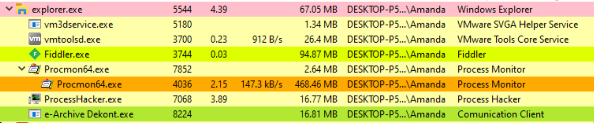
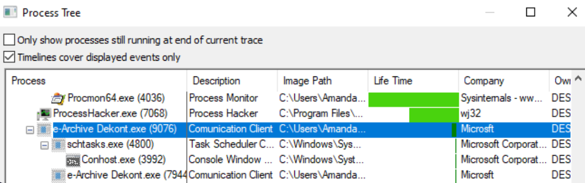

Here is the **final, polished version of Entry #17**.

I have integrated the **False Positive comparison** and the **Impact Assessment** sections. These additions transform the entry from a simple "how-to" into a professional-grade SOC playbook that demonstrates critical thinking skills.

***

# 📘 SOC Analyst Handbook: Dynamic Malware Analysis

**Category:** Malware Analysis / Incident Response
**Severity:** Critical
**Skill Level:** Intermediate / Advanced

---

### 1. The Concept

**The Analogy (ELI5)**
*   **Static Analysis:** Dissecting a dead frog. You see the organs (code), but you don't know how high it jumps.
*   **Dynamic Analysis:** Putting a live frog in a glass box and poking it with a stick. You watch how it moves, what it eats, and where it tries to hide. It’s dangerous, but it shows you actual **behavior**.

**The Technical Definition**
**Dynamic Analysis** involves executing a malware sample in a secure, isolated environment (Sandbox/VM) to observe its interactions with the Operating System. The goal is to harvest **IOCs (Indicators of Compromise)**—such as C2 IPs, dropped files, and Mutexes—that can be used to detect the threat across the rest of the network.

---

### 2. The Toolbox (Your Sensors)

| Tool | Function | The SOC "Use Case" |
| :--- | :--- | :--- |
| **Process Hacker** | Task Manager on Steroids | Spotting **Process Injection** and parent-child anomalies. |
| **Procmon** | System Logger | Tracking **File Writes** and **Registry Changes** in real-time. |
| **Wireshark** | Packet Sniffer | Capturing raw **C2 Traffic** and DNS requests. |
| **Fiddler/Burp** | HTTP Proxy | Decrypting HTTPS to see the **Data Exfiltration** payload. |
| **Regshot** | System Diff | Taking a "Before & After" photo to find **Persistence**. |
| **INetSim** | Fake Internet | Simulating DNS/HTTP responses so the malware *thinks* it is online. |

---

### 3. The Playbook (Step-by-Step)

#### **Phase 1: The Safety Check (Critical)**
1.  **Snapshot:** Take a VM snapshot named "Clean State". You *will* destroy this machine.
2.  **Isolation:** Ensure Network Adapter is **Host-Only** (safe) or **NAT** (risky - malware reaches real internet).
3.  **Baseline:** Run **Regshot** -> "1st Shot".

#### **Phase 2: Sensor Calibration**
*   **Procmon:** Open it -> Stop Capture -> Clear Logs. **Set Filters immediately** (see Section 4).
*   **Wireshark:** Start capture on the active adapter.
*   **Process Hacker:** Open and sort by "Tree View".

#### **Phase 3: Detonation**
1.  **Execute:** Right-click Malware -> **Run as Administrator**.
2.  **Stimulate:** Some malware waits for user interaction. Move the mouse, open a folder, type some keys.
3.  **Wait:** Allow 3–5 minutes for "Sleep" timers to expire.

#### **Phase 4: Capture & Diff**
1.  **Stop** all captures.
2.  **Regshot:** "2nd Shot" -> "Compare". Save the output text file.
    

---

### 4. Deep Dive Analysis (Logs & Anomalies)

This is where you find the IOCs.

#### **A. Process Anomalies (Process Hacker)**
Look for **Parent-Child Relationships** that make no sense.
*   **Normal:** `explorer.exe` -> `chrome.exe` (User opened browser).
*   **Malicious (Word Macro):** `winword.exe` -> `cmd.exe` -> `powershell.exe`.
*   **Malicious (Dropper):** `update.exe` (Malware) -> `svchost.exe` (Legit Windows process).




#### **B. Filesystem & Registry (Procmon)**
Procmon generates millions of events. Use these filters to find the needle in the haystack.

**🛡️ The "Golden Filters" for Procmon:**
1.  `Process Name` **is** `malware.exe` -> Include
2.  `Operation` **contains** `WriteFile` -> Include (Shows dropped files)
3.  `Operation` **contains** `RegSetValue` -> Include (Shows settings changes)
4.  `Path` **contains** `.exe` OR `.dll` -> Include

**📝 Example Procmon Log (Dropper):**
```text
Time: 10:01:22 | Process Name: invoice.exe | Operation: WriteFile
Path: C:\Users\Admin\AppData\Local\Temp\evil_update.exe
Result: SUCCESS | Detail: Length: 45000
```
*   **Finding:** The malware dropped a secondary payload in the Temp folder.




#### **C. Persistence Mechanisms (Regshot)**
How does the malware ensure it restarts after a reboot?
**📝 Example Regshot Output:**
```text
Keys added: 1
HKCU\Software\Microsoft\Windows\CurrentVersion\Run\Updater
Values added: 1
Value: "C:\Users\Admin\AppData\Local\Temp\evil_update.exe"
```

#### **D. Network Traffic (Wireshark)**
Look for the "Beacon" (Checking in with the hacker).
**🚩 Anomaly: The "Heartbeat"**
*   Malware often connects to C2 at regular intervals (e.g., every 60 seconds exactly).
*   Filter: `http.request.method == "POST"`

---

### ⚠️ 5. Signal vs. Noise (Critical Thinking)

New analysts often confuse legitimate admin activity with malware. Use this guide to distinguish them.

| Observation | ✅ Benign (False Positive) | ❌ Malicious (True Positive) |
| :--- | :--- | :--- |
| **PowerShell** | Admin running a maintenance script. Code is readable/clear text. | Encoded command (`-enc JAB...`). Hidden window (`-w hidden`). Downloading strings from the web. |
| **Temp .exe File** | Software Updater (e.g., `SpotifySetup.exe`). Usually Digitally Signed. | Random name (`a8s7d.exe`). Unsigned. Hidden attribute. |
| **HTTP POST** | Telemetry/API call (e.g., Google/Microsoft). Standard User-Agent. | Periodic Beacon (Heartbeat). Weird User-Agent (e.g., `python-requests`). Encrypted/Gargled Data. |
| **Run Key Added** | Legitimate App (OneDrive, Discord) adding itself to startup. | Points to `AppData` or `Temp`. Misspelled name (`Wind0wsUpdate`). |
| **DNS Traffic** | Queries to CDN or Cloudflare. | **DGA:** Random domains (`x84kf.ru`, `qwer99.com`). **Tunneling:** `password.badsite.com`. |

---

### 📊 6. Impact Assessment (Post-Analysis)

After you finish the technical analysis, you must answer the **"So What?"** for the business.

**1. Data at Risk**
*   *Did it touch `Documents`?* (Ransomware / Data Theft)
*   *Did it access `LSASS` or Browser Files?* (Credential Theft - User needs password reset immediately).
*   *Did it upload data?* (Exfiltration).

**2. Blast Radius**
*   *Single Host:* Did it just stay on the local machine?
*   *Lateral Movement:* Did it try to scan the network (Port 445/SMB) or connect to the Domain Controller? (If yes, the whole network is at risk).

**3. Business Impact**
*   *Confidentiality:* Did we lose customer data? (InfoStealer).
*   *Availability:* Is the machine unusable? (Ransomware/Wiper).

**4. Urgency**
*   *Immediate Containment:* Active C2 detected? Isolate now.
*   *Monitor:* Failed execution? Update AV signatures and watch.

---

### 🛑 SOC Pro-Tips (Evasion Techniques)

1.  **The "Sleep" Trick:**
    *   Malware knows sandboxes only run for 5 minutes. It executes `Sleep(600000)` (10 minutes) to wait you out.
    *   *Counter:* Use a debugger to fast-forward time.
2.  **Geo-Fencing:**
    *   Some malware checks the IP. If not in a target country, it deletes itself.
    *   *Counter:* Use a VPN in your lab.
3.  **The "Mutex" (Golden IOC):**
    *   Malware creates a "Mutex" (memory marker) to avoid infecting the same PC twice.
    *   *Action:* Find this string in **Process Hacker**. It is a unique fingerprint for that malware family.

---

### TL;DR for Interviews / Quick Recall
*   **The Flow:** Baseline (Regshot) -> Monitor (Procmon/Wireshark) -> Detonate -> Diff.
*   **Process Hacker:** Spot parent-child anomalies (Word spawning PowerShell).
*   **Procmon Filter:** Filter for `WriteFile` (Drops) and `RegSetValue` (Persistence).
*   **Golden IOC:** The **Mutex** and **C2 IP**.
*   **Analysis Logic:** Don't just list what happened; explain the **Impact** (Data Loss vs. Disruption).

### 🎯 MITRE ATT&CK Mapping
*   **T1053:** Scheduled Task/Job (Persistence).
*   **T1547:** Boot or Logon Autostart Execution (Registry Run Keys).
*   **T1071:** Application Layer Protocol (C2 Traffic).
*   **T1497:** Virtualization/Sandbox Evasion (Sleep timers).