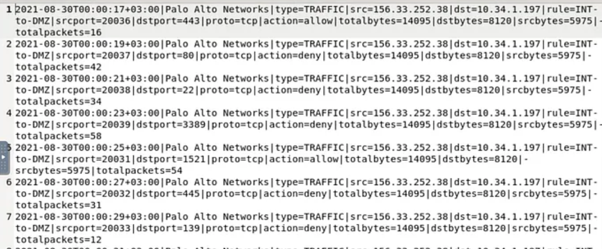

# 📘 SOC Analyst Handbook: Firewalls (FW)

**Category:** Network Defense & Segmentation
**Severity:** N/A (Defensive Tool) - *Misconfiguration is Critical*
**Skill Level:** Core / Fundamental

---

### 1. The Concept

**The Analogy (ELI5)**
Imagine a corporate building with a security guard at the front desk.
*   **Packet Filtering FW:** The guard checks your ID badge. If your name is on the list, you enter. He doesn't care what you are carrying in your bag.
*   **Next-Gen Firewall (NGFW):** The guard checks your ID, X-rays your bag (Deep Packet Inspection), checks if you look nervous (Behavior), and follows you to the elevator to make sure you only go to the floor allowed on your badge (Application Control).

**The Technical Definition**
A **Firewall** is a network security device that monitors and controls incoming and outgoing network traffic based on predetermined security rules. It acts as a barrier between a trusted network (Internal/LAN) and an untrusted network (Internet). It functions primarily at Layer 3 (Network) and Layer 4 (Transport), though NGFWs operate up to Layer 7 (Application).

---

### 2. The Mechanism (Types & Evolution)

Firewalls have evolved. You will likely encounter these three types:

1.  **Packet Filtering (Stateless):** The "Old School" type.
    *   Checks Source IP, Destination IP, and Port.
    *   *Fast but dumb.* It doesn't know if a packet is part of an existing conversation or a new one.
2.  **Stateful Inspection:**
    *   Tracks the **State** of connections (e.g., TCP Handshake).
    *   If you send a request OUT to Google, it automatically allows the reply IN from Google, because it remembers the state.
3.  **Next-Generation Firewall (NGFW) / UTM:**
    *   The industry standard (Palo Alto, Fortinet, Checkpoint).
    *   Includes **DPI (Deep Packet Inspection)** to look inside the packet payload.
    *   Can identify applications (e.g., "This is Facebook traffic," not just "This is Port 443").
    *   Often integrates IPS, Antivirus, and Sandbox features.

---
Here is a concise breakdown of the **10 Firewall Types** to add to your **Entry #12**. You can insert this into **Section 2: The Mechanism**.

***

###  Quick Reference: 10 Types of Firewalls

1.  **Application-Level Gateways (Proxy):** Acts as a "middleman." The client connects to the proxy, and the proxy connects to the destination. It inspects the actual content (Layer 7) but can be slow.
2.  **Circuit-Level Gateways:** Monitors the TCP Handshake (session establishment) to ensure the connection is legitimate. It does **not** inspect the packet payload (fast but less secure).
3.  **Cloud Firewalls (FWaaS):** Hosted in the cloud rather than on-premise hardware. It scales automatically and is used to protect cloud infrastructure (AWS/Azure) or remote offices.
4.  **Endpoint Firewalls:** Software installed on a specific device (e.g., Windows Defender, iptables). It protects that single host from inside the network.
5.  **NAT Firewalls:** Primarily acts as an IP translator (Private to Public IP). It blocks unsolicited incoming traffic because it doesn't know which internal IP to send it to.
6.  **Next-Generation Firewalls (NGFW):** The modern standard. Combines packet filtering with **Deep Packet Inspection (DPI)**, Application Awareness (e.g., blocking "Facebook Games" but allowing "Facebook Chat"), and IPS.
7.  **Packet-Filtering Firewalls:** The oldest type. Looks **only** at Source IP, Destination IP, and Port. It is stateless (doesn't remember previous packets).
8.  **Stateful Multi-Layer Inspection (SMLI):** Tracks the "State" of active connections (e.g., remembers that *you* started the conversation, so the reply is allowed). Inspects across multiple OSI layers.
9.  **Threat-Focused NGFW:** An NGFW that integrates real-time **Threat Intelligence feeds**. It actively updates its blocking rules based on known global attacks happening *right now*.
10. **Unified Threat Management (UTM):** A "Swiss Army Knife" for small businesses. It combines Firewall, Antivirus, VPN, and Spam Filtering into one single physical box.


### 💥 3. Impact Analysis (Misconfiguration)

A firewall is only as good as its rules. A bad configuration leads to:
1.  **Data Exfiltration:** If "Outbound" traffic is unrestricted (Any-Any-Allow), malware can easily send stolen data to the attacker.
2.  **Lateral Movement:** If there are no firewalls between internal departments (e.g., HR can talk to Engineering), a hacker needs to compromise only one PC to own the whole network.
3.  **C2 Communication:** Malware can "phone home" to receive commands if the firewall doesn't block malicious domains.

---

### 4. The Detective's Lens (Logs & Patterns)

Firewall logs are high volume. You need to filter them effectively.

#### **Key Log Fields**
*   **Action:** `Allow`, `Deny`, `Drop`, `Reject`.
*   **Direction:** `Inbound` vs. `Outbound`.
*   **Service/App:** `HTTPS`, `DNS`, `SSH`, `TeamViewer`.
*   **Interface:** `WAN` (Outside) vs. `LAN` (Inside).



#### **Example Log Snippet (Syslog/Fortinet Style)**
```text
date=2023-10-27 time=10:00:01 devname="Edge-FW" srcip=192.168.1.50 dstip=142.250.1.1 dstport=443 proto=6 action=accept policyid=5 app="Google-Drive" msg="Traffic Allowed"
date=2023-10-27 time=10:05:00 devname="Edge-FW" srcip=45.33.2.1 dstip=10.0.0.5 dstport=3389 proto=6 action=deny policyid=0 msg="Implicit Deny"
```
*   **Log 1 Analysis:** Internal user (`192.168.1.50`) went to Google Drive. Action: **Accept**.
*   **Log 2 Analysis:** External IP (`45.33.2.1`) tried to RDP (`3389`) into our server. Action: **Deny**. (This is the firewall doing its job).

---

### 🌳 5. Mini Decision Tree (Triage Logic)

*   **🟢 Low Priority (Noise)**
    *   `Inbound` + `Deny/Drop` + `Port Scan`
    *   *Action:* Ignore. The firewall did its job. The internet is full of scanners.

*   **🟡 Medium Priority (Policy Violation)**
    *   `Outbound` + `Deny` + `Internal User`
    *   *Action:* User tried to access a blocked site (e.g., Gambling/Porn) or a non-standard port. Investigate if it was accidental or malicious.

*   **🔴 High Priority (Exfiltration/C2)**
    *   `Outbound` + `Allow` + `Rare Destination` + `High Data Volume`
    *   *Action:* A device is sending data to a strange IP. **Investigate Immediately.**

*   **🟣 Critical Priority (Perimeter Breach)**
    *   `Inbound` + `Allow` + `Management Port (SSH/RDP)` + `Public IP`
    *   *Action:* Someone from the internet successfully connected to an internal server's admin port. **Assume Compromise.**

---

### 6. Investigation Steps (The Playbook)

**Step 1: Check the Direction**
*   **Inbound Deny:** Good.
*   **Inbound Allow:** Did we *intend* to open this port?
*   **Outbound Deny:** infected host trying to call home?
*   **Outbound Allow:** Normal traffic OR Exfiltration.

**Step 2: Check the Rule ID (Policy ID)**
*   Which rule allowed this?
*   Is it the "General Internet Access" rule, or a specific "Vendor Access" rule?

**Step 3: Protocol vs. Port**
*   *Legacy FW:* Sees Port 80.
*   *NGFW:* Sees Application "BitTorrent" running on Port 80.
*   *Investigation:* If you see a mismatch (e.g., Non-HTTP traffic on Port 80), it's likely malware tunneling.

---

### 💻 7. Configuration Lab: The "Any-Any" Trap

One of the most common findings in firewall audits is the "Any-Any" rule.

**❌ VULNERABLE CONFIGURATION (The "Lazy Admin"):**
```text
Rule Name: Allow_All_Outbound
Source: Internal_Net (192.168.1.0/24)
Destination: ANY (0.0.0.0/0)
Service: ANY
Action: ALLOW
```
*   **Why it's bad:** If a PC gets infected with malware, the malware can connect to *any* server in the world on *any* port (IRC, custom C2 ports) to steal data. The firewall permits it all.

**✅ SECURE CONFIGURATION (Least Privilege):**
```text
Rule Name: Allow_Web_DNS_Only
Source: Internal_Net
Destination: ANY
Service: HTTP, HTTPS, DNS
Action: ALLOW
---------------------------------
Rule Name: CLEANUP_RULE (Implicit Deny)
Source: ANY
Destination: ANY
Service: ANY
Action: DENY (Log=Yes)
```
*   **Why it's good:** Users can browse the web. If malware tries to connect to a C2 server on Port 6667, the firewall hits the "Cleanup Rule," blocks it, and creates a log entry for the SOC to see.

---

### 8. Remediation & Defense

**Immediate Actions (SOC)**
1.  **Shun/Block IP:** If an attack is persistent, add the Source IP to a temporary "Penalty Box" rule at the very top of the rule list.
2.  **Isolate Internal Host:** If you see "Outbound Deny" C2 beacons from a laptop, take it off the network.

**Long-term Fixes (Engineering)**
1.  **Geo-Blocking:** If your company only does business in the US, block all traffic from other countries.
2.  **Segment the Network:** Put Printers, IoT, and Servers in different VLANs. Put a Firewall between them.
3.  **Review "Shadow Rules":** Remove old temporary rules (e.g., "Allow Vendor X for 2 days" that was left open for 2 years).

---

### 🛑 SOC Pro-Tips (Beyond the Basics)

1.  **The "Implicit Deny" is Silent:**
    *   Most firewalls have a hidden rule at the bottom: "Block Everything Else."
    *   *Warning:* Usually, this rule **does not log**.
    *   *Tip:* Always create an explicit "Cleanup Rule" at the bottom (Any -> Any -> Deny) and turn on **Logging**. Otherwise, you are blind to dropped traffic.

2.  **Top-Down Processing:**
    *   Firewalls read rules from 1 to 100. The first match wins.
    *   If Rule #1 says "Block 1.2.3.4" and Rule #2 says "Allow All," the IP is blocked.
    *   If Rule #1 says "Allow All" and Rule #2 says "Block 1.2.3.4," the IP is **allowed**. Order matters!

3.  **Internal Firewalls (East-West Traffic):**
    *   Perimeter Firewalls (North-South) protect you from the internet.
    *   Internal Firewalls (East-West) prevent a hacker moving from the Receptionist's PC to the CEO's Laptop. This is "Zero Trust."

---

### TL;DR for Interviews / Quick Recall
*   **What:** Controls traffic based on rules (IP/Port/App).
*   **Types:** Packet Filtering (Basic), Stateful (Tracks Connections), NGFW (App Awareness/DPI).
*   **Critical Concept:** **Ingress** (Inbound) vs. **Egress** (Outbound) filtering.
*   **Common Mistake:** "Any-Any" Allow rules (Permissive Egress).
*   **Detection:** Look for "Outbound Deny" (Infected host) or "Inbound Allow" from unexpected locations.
*   **Response:** Block IP, Segment Network, Audit Rules.

### 🎯 MITRE ATT&CK Mapping
*   **M1037:** Filter Network Traffic.
*   **T1562.004:** Impair Defenses: Disable or Modify System Firewall.
*   **T1048:** Exfiltration Over Alternative Protocol (caught by Egress filtering).