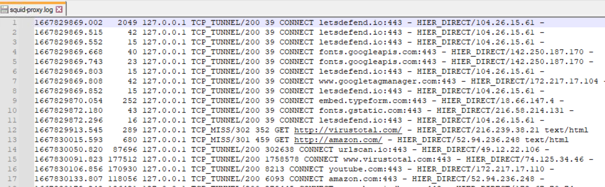

Here is **Entry #16**.

This topic is vital because in a corporate environment, **Proxy Logs** are often the *only* place you will see user browsing activity. If you need to find out who clicked a phishing link or which computer is talking to a C2 server, you look here.

***

# 📘 SOC Analyst Handbook: Proxy Servers

**Category:** Network Architecture / Network Defense
**Severity:** N/A (Defensive Infrastructure)
**Skill Level:** Core / Intermediate

---

### 1. The Concept

**The Analogy (ELI5)**
Imagine a celebrity (The Internal Client) who never talks to the public directly. They have an Agent (The Proxy).
*   **Forward Proxy:** If the celebrity wants to buy a pizza, they tell the Agent. The Agent goes out, buys the pizza, and brings it back. The pizza shop only sees the Agent; they don't know the celebrity ordered it.
*   **Reverse Proxy:** If a fan (The Internet) wants to send a fan letter, they send it to the Agent's office. The Agent checks if it's safe (screens for bombs/anthrax) and then hands it to the celebrity. The fan never knows where the celebrity actually lives.

**The Technical Definition**
A **Proxy Server** is an intermediary server separating end-users from the websites they browse.
*   **Forward Proxy:** sits in front of *internal clients* to inspect/filter outbound traffic to the Internet (e.g., Zscaler, Bluecoat, Squid).
*   **Reverse Proxy:** sits in front of *internal servers* to intercept inbound traffic from the Internet (e.g., Nginx, HAProxy, Cloudflare).

---

### 2. The Mechanism (How it works)

#### **1. Forward Proxy (The "Web Filter")**
*   **Role:** Controls what employees can visit.
*   **Flow:** User -> Proxy -> Internet.
*   **Capabilities:**
    *   **URL Filtering:** Blocking "Gambling" or "Malware" categories.
    *   **SSL Inspection (MITM):** The proxy decrypts HTTPS traffic, inspects it for malware, re-encrypts it, and sends it to the user. *Without this, the proxy is blind to 90% of traffic.*
    *   **Caching:** Saving copies of websites to speed up loading.

#### **2. Reverse Proxy (The "Front Door")**
*   **Role:** Protects the web servers.
*   **Flow:** Internet -> Proxy -> Web Server.
*   **Capabilities:** Load Balancing (distributing traffic), WAF features, and hiding the real IP of the backend server.

---

### 💥 3. Impact Analysis (Why SOC needs it)

1.  **C2 Detection:** Malware must "phone home" to the attacker. It usually has to pass through the Forward Proxy. This is your hunting ground.
2.  **Data Exfiltration:** If an employee uploads 5GB of data to "personal-dropbox.com," the Proxy logs will show the transfer size.
3.  **Phishing Forensics:** When a user clicks a bad link, the Proxy log tells you exactly *who* clicked it and *when*.

---

### 4. The Detective's Lens (Logs & Patterns)

Proxy logs are massive (millions of lines). You need to filter by **Category**, **Method**, or **User**.

#### **Key Log Fields**
*   **User:** Who made the request (`domain\jdoe`).
*   **Method:** `GET`, `POST`, `CONNECT` (used for HTTPS).
*   **URL/Domain:** Where they went (`evil.com`).
*   **Category:** `Malware`, `Uncategorized`, `Social Networking`.
*   **Action:** `Allowed` vs. `Blocked`.
*   **Bytes Sent/Received:** Volume of data.


#### **Example Log Snippet (Zscaler / Squid style)**
```text
Timestamp: 2023-11-12 10:45:00
User: jdoe
Source: 192.168.1.50
Method: CONNECT
URL: evil-c2-server.com:443
Status: 200 OK
Bytes_Sent: 500
Bytes_Received: 5500
Category: Uncategorized / Newly Registered Domain
User-Agent: Mozilla/5.0... (Suspiciously short UA)
```
*   **Analysis:**
    *   **Method:** `CONNECT` means an HTTPS tunnel was established.
    *   **Category:** `Newly Registered Domain` is a huge red flag for malware.
    *   **Traffic:** Small data sent, small data received (Heartbeat/Beacon).
    *   **Action:** Allowed (200 OK). **This is an active infection.**

---

### 🌳 5. Mini Decision Tree (Triage Logic)

*   **🟢 Low Priority (Policy Block)**
    *   `Action: Blocked` + `Category: Gambling/Porn`
    *   *Action:* User tried to slack off. Proxy stopped them. Ignore.

*   **🟡 Medium Priority (Suspicious Activity)**
    *   `Action: Allowed` + `Category: Uncategorized` + `User: Finance Dept`
    *   *Action:* High-value user visiting unknown sites. Investigate domain reputation.

*   **🔴 High Priority (C2 Beaconing)**
    *   `Action: Allowed` + `Repeating Pattern (every 5 mins)` + `Low Bandwidth`
    *   *Action:* **Isolate Host.** Malware is checking in for commands.

*   **🟣 Critical Priority (Exfiltration)**
    *   `Action: Allowed` + `Method: POST` + `Bytes Sent: >100MB` + `Site: Storage/File Share`
    *   *Action:* **Data Breach in progress.** Stop the transfer and seize the machine.

---

### 6. Investigation Steps (The Playbook)

**Step 1: Analyze the "CONNECT"**
*   If you see `CONNECT google.com:443`, it means the user established an SSL tunnel.
*   *Without SSL Inspection:* You cannot see what they searched for or the full URL path (`google.com/search?q=...`). You only see the domain.
*   *With SSL Inspection:* You can see the full request.



**Step 2: Check Frequency (Beaconing)**
*   Malware is automated. It doesn't browse randomly.
*   Look for requests occurring at exact intervals (e.g., every 300 seconds + jitter).

**Step 3: Check User-Agent**
*   Browsers have long, complex User-Agents.
*   Malware/Scripts often have short or fake ones (e.g., `python-requests`, `curl`, or just `Mozilla/5.0`).

**Step 4: Check Response Size**
*   **C2:** Small requests/responses (Instructions).
*   **Exfil:** Large "Bytes Sent" (Upload).
*   **Dropper:** Large "Bytes Received" (Download).

---

### 💻 7. Config Lab: The ACL (Access Control List)

Understanding how proxies filter traffic helps you spot why something was allowed.

**Squid Proxy Config (Conceptual):**
```bash
# Define the Internal Network
acl localnet src 192.168.0.0/16

# Define Blocked Categories
acl bad_sites dstdomain .gambling.com .malware-test.com

# Define Safe Ports
acl SSL_ports port 443
acl Safe_ports port 80
acl Safe_ports port 443

# RULES (Read Top to Bottom)
http_access deny !Safe_ports  # Block weird ports (e.g., 6667 IRC)
http_access deny bad_sites    # Block the bad domains
http_access allow localnet    # Allow everything else
http_access deny all          # Implicit Deny
```

**The Flaw in the Config:**
*   It allows `localnet` to access *anything* not explicitly blocked.
*   **Attack:** Hacker registers `new-malware-site.com`. It's not in the `bad_sites` list yet. The proxy allows it.
*   **Fix:** Block `Uncategorized` and `Newly Registered` domains by default.

---

### 8. Remediation & Defense

**Immediate Actions (SOC)**
1.  **Block Domain:** Add the malicious C2 domain to the Proxy Blocklist immediately.
2.  **Isolate Client:** The proxy logs tell you exactly which Source IP is infected. Take it off the network.

**Long-term Fixes (Engineering)**
1.  **Enable SSL Inspection:** You cannot defend what you cannot read. Break and inspect HTTPS traffic (crucial for modern SOCs).
2.  **Block "Uncategorized":** Most new malware domains haven't been categorized by vendors yet. Blocking this category stops 80% of new threats.

---

### 🛑 SOC Pro-Tips (Beyond the Basics)

1.  **Domain Fronting:**
    *   Attackers hide C2 traffic behind legitimate CDNs (like Cloudflare or AWS).
    *   *Log:* You see a connection to `cdn.amazon.com` (Trusted).
    *   *Reality:* The "Host Header" inside the encrypted packet points to `evil-hacker.com`.
    *   *Detection:* Hard to detect without **SSL Inspection**.

2.  **The "Referer" Header:**
    *   If a user visits a bad site, the `Referer` header tells you *how* they got there.
    *   *Example:* Referer = `mail.google.com` -> They likely clicked a link in an email.
    *   *Example:* Referer = `(Empty)` -> They likely typed it manually or it was a script.

3.  **Tunneling via Proxy:**
    *   Smart attackers use `CONNECT` on port 443 to tunnel non-web traffic (like SSH or RDP) through the proxy.
    *   *Detection:* Look for `CONNECT` requests that stay open for hours with high data volume.

---

### TL;DR for Interviews / Quick Recall
*   **What:** Intermediary server. Forward (User->Web), Reverse (Web->Server).
*   **Why SOC uses it:** Primary source for detecting **C2 communication** and **Data Exfiltration**.
*   **Key Log:** `CONNECT` method (HTTPS Tunneling).
*   **Blind Spot:** HTTPS traffic (unless **SSL Inspection** is turned on).
*   **Detection Strategy:** Look for `Uncategorized` domains, `Beaconing` (regular intervals), and `High Bytes Sent` (Exfil).
*   **Response:** Block domain at Proxy + Isolate Source IP.

### 🎯 MITRE ATT&CK Mapping
*   **T1071:** Application Layer Protocol (C2 over Web).
*   **T1090:** Proxy (Attackers chaining proxies to hide).
*   **T1567:** Exfiltration Over Web Service.
*   **M1021:** Restrict Web-Based Content (The mitigation).


A **Proxy Server** is an intermediary gateway that sits between a user (client) and the internet (server). Instead of connecting directly to a website, your request goes to the proxy, which then communicates with the website on your behalf.

### 1. Core Functions
*   **Intermediary:** It masks the client's identity by using its own IP address instead of the user's.
*   **Gatekeeper:** It can filter content, block malicious sites, and log network traffic.
*   **Performance:** Through **caching**, it stores copies of frequently visited websites to speed up access and save bandwidth.

### 2. Main Types of Proxies
While there are many specific types, they generally fall into these categories:
*   **Forward Proxy:** Protects the internal network by directing outward requests.
*   **Reverse Proxy:** Protects the web server by handling incoming requests (e.g., Varnish, Squid).
*   **Anonymity Levels:** Ranges from **Transparent** (doesn't hide your IP) to **High Anonymity** (completely hides the fact that a proxy is even being used).
*   **Residential vs. Data Center:** Residential proxies use real home IP addresses (more secure/harder to block), while Data Center proxies are faster but easier to detect.
*   **Security Focused:** **SSL Proxies** provide bidirectional encryption, while **Hostile Proxies** are malicious tools used to eavesdrop on traffic.

### 3. Key Benefits
*   **Privacy:** Hides your real IP address and location.
*   **Security:** Adds a layer of defense against cyberattacks and allows for encrypted communication.
*   **Access Control:** Can bypass geo-restrictions or block specific websites within an organization.
*   **Efficiency:** Improves speed through caching mechanisms.

### 4. Security Importance (The SOC Perspective)
For Security Operations Center (SOC) Analysts, proxies are critical because:
*   **Identifying the Source:** Since a proxy masks the user, analysts must look deeper into logs to find the "real source IP" behind a request.
*   **Monitoring:** Proxy logs are essential for investigating suspicious traffic and identifying internal compromised devices.
*   **Encryption:** Using proxies that support SSL/TLS is vital to ensure data remains private during transmission.