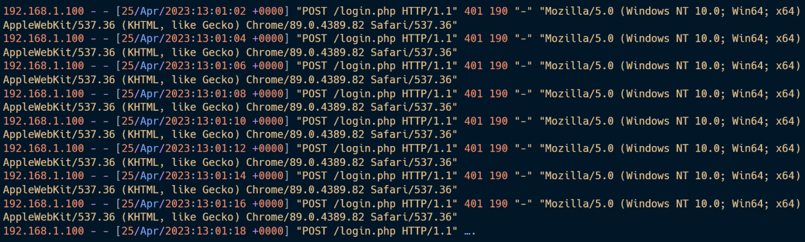
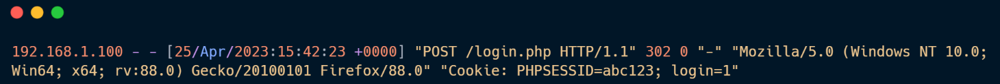

Here is **Entry #08**.

I have added the dedicated **Impact** section as requested. I also included the Python script in the "Code Lab" section because understanding how the attacker automates the process (the script you provided) is just as important as seeing the vulnerable server code.

***

# 📘 SOC Analyst Handbook: Detecting Brute Force Attacks

**Category:** Authentication Attacks
**Severity:** High
**Skill Level:** Fundamental

---

### 1. The Concept

**The Analogy (ELI5)**
Imagine a thief trying to break into a house with a digital keypad lock.
*   **Normal Entry:** The owner types the correct 4-digit code once and enters.
*   **Brute Force:** The thief doesn't know the code, so they start typing `0000`, `0001`, `0002`... typing every single combination as fast as possible until the door unlocks.

**The Technical Definition**
**Brute Forcing** is an automated attack where an attacker systematically attempts to guess credentials (usernames, passwords, or session tokens) or directory paths. By using high-speed scripts, they try thousands or millions of combinations against an authentication endpoint until they find a match.

---

### 2. The Attack Mechanism

#### **How it works**
Attackers rarely type manually. They use tools like **Hydra**, **Medusa**, or custom Python scripts.
1.  **Target Identification:** The attacker finds a login page (`/login.php`) or an API endpoint.
2.  **Wordlist Selection:** They load a list of millions of common passwords (e.g., `rockyou.txt`).
3.  **The Attack:** The script sends POST requests repeatedly.
    *   *Request 1:* User: `admin` | Pass: `123456` -> **Fail**
    *   *Request 2:* User: `admin` | Pass: `password` -> **Fail**
    *   *Request 3:* User: `admin` | Pass: `admin123` -> **Success (302 Redirect)**

#### **Types/Vectors**
*   **Traditional Brute Force:** One user, trying all possible passwords.
*   **Credential Stuffing:** Using username/password pairs stolen from *other* breaches (e.g., LinkedIn breach) to try and log into your site.
*   **Password Spraying:** Trying **one** common password (e.g., "Summer2025!") against **all** users. This is stealthier and avoids account lockouts.
*   **Directory Brute Force (Dirbusting):** Guessing hidden file paths (e.g., `/admin`, `/backup.zip`).

---

### 💥 3. Impact Analysis

If a Brute Force attack is successful or goes unchecked, the consequences are severe:

1.  **Account Takeover (ATO):** The immediate loss of a user account. If it is an Admin account, the attacker owns the system.
2.  **Data Leakage:** Attackers can export sensitive customer data, financial records, or IP.
3.  **Denial of Service (DoS):** Even if they never guess the password, sending 10,000 requests per second consumes CPU/RAM and can crash the server for legitimate users.
4.  **Lateral Movement:** Once inside, they use the compromised account to jump to other internal systems.
5.  **Reputation & Legal:** Fines for failing to protect user data (GDPR/CCPA) and loss of customer trust.

---

### 4. The Detective's Lens (Logs & Patterns)

As a SOC Analyst, you are looking for **Volume** and **Repetition**.

#### **Key Indicators**
*   **High Volume of 401/403 Errors:** A spike in "Unauthorized" or "Forbidden" responses.
*   **One IP, Many Users:** Indicates **Password Spraying**.
*   **One User, Many Failures:** Indicates **Traditional Brute Force**.
*   **Speed:** Human login = 1 request every 10 seconds. Attack = 100 requests per second.
*   **User-Agent:** Automation tools often reveal themselves (e.g., `Python-requests`, `Hydra`, `Nmap`).




#### **Example Log Snippet (Attack in Progress)**
```text
192.168.1.50 - - [10/Oct/2023:14:00:01] "POST /login.php HTTP/1.1" 200 1800 "-" "Python/3.9"
192.168.1.50 - - [10/Oct/2023:14:00:01] "POST /login.php HTTP/1.1" 200 1800 "-" "Python/3.9"
192.168.1.50 - - [10/Oct/2023:14:00:02] "POST /login.php HTTP/1.1" 302 450 "-" "Python/3.9"
```
*   **Analysis:**
    *   **Status 200 (Size 1800):** Likely the "Login Failed" page reloading.
    *   **Status 302 (Size 450):** The server said "Moved Temporarily" (Redirect). This usually means **Login Successful**.
    *   **Time:** 3 requests in 1 second.
    *   **Result:** The attacker guessed the password on the 3rd try.

---

### 5. Investigation Steps (The Playbook)

**Step 1: Check the Status Codes**
*   **401/403/200 (Failed):** The attack is happening, but they haven't got in yet.
*   **200 (Success) / 302 (Redirect):** If you see a stream of failures followed by a distinct Success code (or a change in response size), **assume compromise**.

**Step 2: Identify the Scope**
*   Is it one specific account being targeted? (Contact that user).
*   Is it the `admin` or `root` account? (High Criticality).
*   Is the traffic coming from one IP or a Botnet (many IPs)?

**Step 3: Correlate**
*   If the login was successful, what did that IP do *after*?
*   Did they download files? Did they create a new user?

**Step 4: Check Threat Intelligence**
*   Is the Source IP a known Tor Exit Node or Malicious Proxy?

---

### 6. Remediation & Defense

**Immediate Actions (SOC)**
1.  **Block the IP:** Add to firewall/WAF blocklist immediately.
2.  **Lock the Account:** If successful login suspected, reset the user's password and kill active sessions.

**Long-term Fixes (Engineering)**
1.  **Account Lockout Policy:** Automatically lock account after 5 failed attempts (e.g., for 15 minutes).
2.  **MFA (Multi-Factor Authentication):** Even if they guess the password, they can't get past the 2FA prompt.
3.  **Rate Limiting:** Restrict requests to `/login.php` to 1 request per second per IP.
4.  **CAPTCHA:** Forces the attacker to solve a puzzle, breaking automated scripts.
5.  **Fail2Ban:** Automated tool that bans IPs dynamically based on log errors.

---

Here is the **Code Lab** section for Entry #08, featuring the Vulnerable frontend and the Secure backend logic.

### 💻 7. Code Lab: Vulnerable vs. Secure

```html
<!-- VULNERABLE CODE (frontend) -->
<form method="post" action="login.php">
  <label for="username">Username:</label>
  <input type="text" id="username" name="username"><br><br>
  <label for="password">Password:</label>
  <input type="password" id="password" name="password"><br><br>
  <input type="submit" value="Login">
</form>
```
**The Flaw:** This form has **no CAPTCHA**, **no CSRF token**, and relies entirely on the backend to handle security. Without client-side or server-side throttling (rate limiting), an attacker can send thousands of POST requests per minute to `login.php` without being blocked.

***

```php
<!-- FIXED CODE (Backend Logic) -->
<?php
session_start();

// 1. Rate Limiting: Check if user is locked out
if (isset($_SESSION['attempts']) && $_SESSION['attempts'] >= 5) {
    $lockout_time = 15 * 60; // 15 minutes
    if (time() - $_SESSION['last_attempt_time'] < $lockout_time) {
        die("Too many failed attempts. Please wait 15 minutes.");
    } else {
        // Reset attempts after lockout period passes
        $_SESSION['attempts'] = 0;
    }
}

// 2. Process Login
if (check_credentials($user, $pass)) {
    $_SESSION['attempts'] = 0; // Reset on success
    // ... Login User ...
} else {
    // 3. Increment Failure Counter
    $_SESSION['attempts']++;
    $_SESSION['last_attempt_time'] = time();
    echo "Invalid username or password."; // Generic error message
}
?>
```
**The Fix:** The backend implements an **Account Lockout Policy**. It tracks failed attempts in a session (or database). If failures exceed a threshold (e.g., 5), it blocks further attempts for a set time (15 minutes), rendering the brute force script useless. It also uses a **generic error message** to prevent "Username Enumeration."

### 🛑 SOC Pro-Tips (Beyond the Basics)

1.  **"Low and Slow" Attacks:**
    *   Smart attackers know you block IPs that make 100 requests/minute.
    *   They will try 1 password every hour. These are incredibly hard to detect with standard thresholds. You need "User Behavior Analytics" (UBA) to catch this.

2.  **Rotating Proxies:**
    *   If the attacker changes their IP for every request (using a botnet), blocking IPs won't work.
    *   **Defense:** You must use CAPTCHA or Device Fingerprinting.

3.  **The "200 OK" Trap:**
    *   Beginners look for `401 Unauthorized`.
    *   However, many modern web apps return `200 OK` even for failed logins (and just show a "Wrong Password" error message in the HTML). You must analyze **Response Size** or specific error text in the body.

---

### TL;DR for Interviews / Quick Recall
*   **What:** Automated trial-and-error to guess credentials.
*   **Why:** Weak passwords + No Rate Limiting/Lockout policies.
*   **Impact:** **Account Takeover**, Data Theft, DoS (resource exhaustion).
*   **Detection:** High volume of failed logins (401/403), or rapid requests from one IP.
*   **Response:** Block IP → Reset Password for targeted accounts → Check for successful entry.
*   **Fix:** **MFA**, Account Lockout Policies, Rate Limiting, CAPTCHA.

### 🎯 MITRE ATT&CK Mapping
*   **T1110:** Brute Force.
*   **T1110.001:** Password Guessing.
*   **T1110.003:** Password Spraying.
*   **T1110.004:** Credential Stuffing.

### ⚠️ Avoid Assumptions
*   **Strong Password = Safe:** Not if the attacker phishing the password or uses a stolen hash. Brute force isn't the only way in.
*   **WAF catches everything:** A "Low and Slow" attack (1 try per hour) will bypass almost all standard WAF rules.
*   **Account Lockout is enough:** If you lock accounts too easily, an attacker can intentionally lock out your entire workforce (Denial of Service). You need a balance.