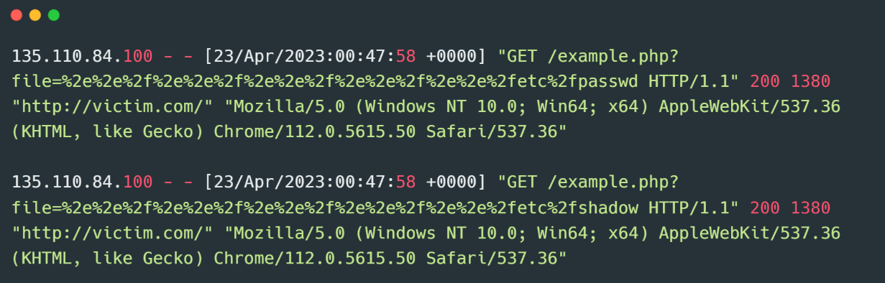
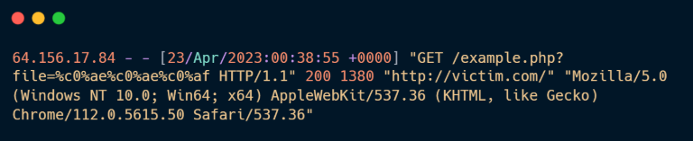
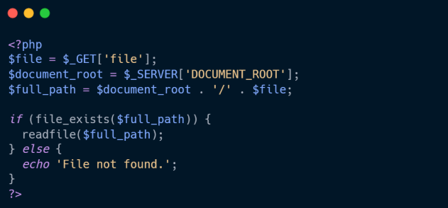
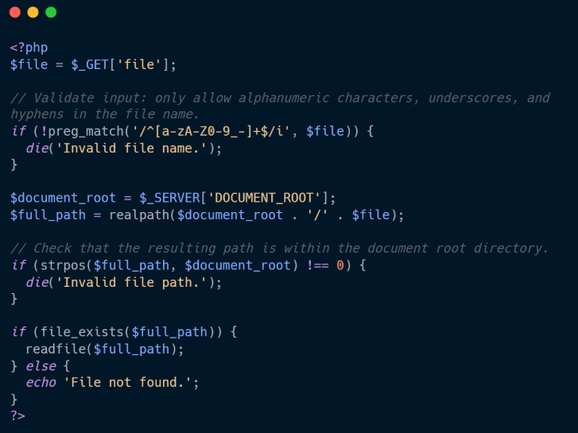

# 📘 SOC Analyst Handbook: Detecting Directory Traversal

**Category:** Broken Access Control
**Severity:** High
**Skill Level:** Fundamental

---

### 1. The Concept

**The Analogy (ELI5)**
Imagine a file clerk in a basement archive. You are allowed to ask for files from "Cabinet A" only.
*   **Normal Request:** "Give me `project.txt`." The clerk opens Cabinet A and hands it to you.
*   **Directory Traversal:** You say, "Give me `../Cabinet-B/payroll.txt`." The `../` command tells the clerk to "step back" out of Cabinet A, walk down the hall, and open the restricted Cabinet B. The clerk, blindly following instructions, hands you the confidential payroll file.

**The Technical Definition**
**Directory Traversal** (also known as Path Traversal) is an attack where an attacker manipulates file path variables using "dot-dot-slash" sequences (`../`) to access files and directories stored **outside** the web root folder.

**❓ Difference from LFI:**
*   **LFI (Local File Inclusion):** The application *executes* the file (e.g., PHP `include()`). If you target a text file containing code, the code runs.
*   **Directory Traversal:** The application *reads* the file (e.g., `file_get_contents()`). The attacker sees the file content, but the server does not execute it as code.

---

### 2. The Attack Mechanism

#### **How it works**
Web applications often load files dynamically based on user input.
1.  **Normal Flow:**
    URL: `http://site.com/view.php?file=report.pdf`
    Server Logic: `open('/var/www/html/reports/' + 'report.pdf')`
2.  **The Exploit:**
    URL: `http://site.com/view.php?file=../../../../etc/passwd`
    Server Logic: `open('/var/www/html/reports/../../../../etc/passwd')`
3.  **The Result:**
    The system resolves the path. Each `../` cancels out one folder level, eventually reaching the root `/`, then accessing `/etc/passwd`.

#### **Common Vectors**
*   **URL Parameters:** `?file=`, `?doc=`, `?path=`.
*   **Cookies:** Storing configuration paths in cookies (e.g., `template=skin1`).
*   **Headers:** Manipulating `Referer` or `User-Agent` (if the server logs these to a file and then reads that file).

---

### 3. The Detective's Lens (Logs & Patterns)

As a SOC Analyst, you are hunting for **Traversal Sequences** and **System File Names**.

#### **Key Indicators**
*   **The Classic:** `../` (Linux) or `..\` (Windows).
*   **Encoded Variations:**
    *   `%2e%2e%2f` = `../`
    *   `%252e%252e%252f` (Double URL Encoding)
    *   `..%c0%af` (Unicode/UTF-8 illegal byte bypass)
*   **Target Files (Linux):** `/etc/passwd`, `/etc/shadow`, `/proc/version`, `/var/log/apache2/access.log`.
*   **Target Files (Windows):** `C:\Windows\win.ini`, `boot.ini`, `web.config`.




#### **Example Log Snippet (Malicious)**
```text
192.168.1.105 - - [15/May/2023:14:10:22] "GET /download.php?file=%2e%2e%2f%2e%2e%2f%2e%2e%2fetc%2fpasswd HTTP/1.1" 200 1850 "-" "Mozilla/5.0..."
```
*   **Analysis:**
    *   **Payload:** `%2e%2e%2f` is `../`.
    *   **Target:** `etc/passwd`.
    *   **Status 200:** The server likely served the file.
    *   **Size 1850:** This is a typical size for a password file. If the normal PDF download is 5MB, this small size confirms the anomaly.

---

### 4. Investigation Steps (The Playbook)

**Step 1: Decode the Payload**
*   You will rarely see plain `../` in logs. It is almost always encoded.
*   **Action:** Use CyberChef to decode URL or Unicode characters.

**Step 2: Analyze the "Depth"**
*   Count the `../`.
*   *Example:* `/var/www/html/` is 3 levels deep. An attacker needs at least `../../../` (3 sets) to get to the root. If you see `../../`, they might only be looking at other web folders, not system root.

**Step 3: Check Response Code & Size**
*   **200 OK:** Dangerous if combined with a suspicious file request.
*   **403 Forbidden:** The server or WAF blocked it.
*   **500 Error:** The code crashed (maybe the file permissions denied read access).

**Step 4: Check for "Blind" Traversal**
*   Sometimes the attacker doesn't see the file, but downloads it. Check the **Bytes Sent** field.

---

### 5. Remediation & Defense

**Immediate Actions (SOC)**
1.  **Block the IP:** Especially if they are enumerating (trying many files rapidly).
2.  **WAF Rules:** Ensure your WAF blocks `%2e%2e%2f` and common system filenames like `passwd` or `win.ini`.

**Long-term Fixes (Engineering)**
1.  **Avoid Direct Input:** Do not pass `$_GET['file']` directly to filesystem functions.
2.  **Use `realpath()`:** In PHP/Python, resolve the path *before* opening it. Check if the resolved path starts with the intended directory (`/var/www/html/docs`).
3.  **Basename only:** Strip directory characters. `basename("../../etc/passwd")` returns just `passwd`, which forces the look-up to stay in the current folder.

---

### 💻 6. Code Lab: Vulnerable vs. Secure


**The Flaw:** The code directly concatenates the user input `$file` to the `$document_root`. It performs **no validation** on the input. If the user sends `../../etc/passwd`, the code blindly builds that path and tries to read it.


**The Fix:**
1.  **Validation:** It uses regex (`preg_match`) to allow *only* alphanumeric characters (no dots or slashes allowed).
2.  **Resolution:** It uses `realpath()` to resolve the absolute path (e.g., converting `../` to the actual folder).
3.  **Verification:** It checks `strpos` to ensure the final resolved path *starts* with the intended `$document_root`. If the user tried to break out, the paths wouldn't match, and the script dies.

---

### 🛑 SOC Pro-Tips (Beyond the Basics)

1.  **Nginx/Apache Misconfigurations:**
    *   Sometimes Traversal isn't code-based, it's config-based.
    *   *Alias Trap:* `location /images { alias /var/www/images/; }` (Note the missing trailing slash on the location).
    *   Request: `/images../private/flag.txt` -> Resolves to `/var/www/private/flag.txt`.

2.  **WAF Bypasses:**
    *   WAFs often strip `../`.
    *   *Payload:* `....//` (If the WAF removes the middle `../`, the remaining dots and slashes merge to form `../` again).
    *   *Payload:* `%c0%ae%c0%ae/` (Overlong UTF-8 encoding).

3.  **Cookie Poisoning:**
    *   Don't just grep URLs. If a site has a "Theme" selector, the attacker might change the cookie `theme=default` to `theme=../../../../var/log/apache.log` to try and read server logs.

---

### TL;DR for Interviews / Quick Recall
*   **What:** Manipulating file paths using `../` to access files outside the intended web directory.
*   **Why:** Application uses user input to build file paths without validating that the result is still within the "Safe Zone."
*   **Impact:** **Information Disclosure** (Source code, config files, OS credentials).
*   **Detection:** Look for `../`, `..%2f`, or system filenames (`/etc/passwd`, `win.ini`) in requests.
*   **Response:** Block IP → Decode Payload → Check if sensitive data was returned (Response Size).
*   **Fix:** Use `basename()` to strip paths, or `realpath()` to verify the resolved path matches the whitelist directory.

### 🎯 MITRE ATT&CK Mapping
*   **T1083:** File and Directory Discovery.
*   **T1005:** Data from Local System.
*   **T1190:** Exploit Public-Facing Application.

### ⚠️ Avoid Assumptions
*   **"It's just an image loader, it's safe":** Image loaders (`image.php?id=`) are the #1 target for directory traversal because they perform file read operations.
*   **404 Not Found = Safe:** The attacker might be "Blind" guessing. 1000 "404s" followed by one "200 OK" means they found a file that exists.
*   **Only Linux:** Windows servers are vulnerable too (`..\..\windows\win.ini`).