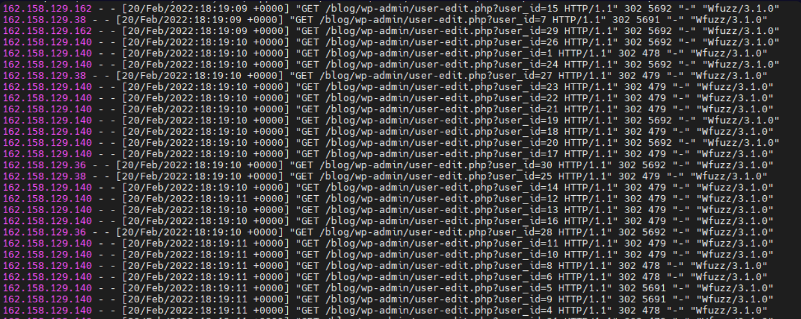

# 📘 SOC Analyst Handbook: Detecting Insecure Direct Object Reference (IDOR)

**Category:** Broken Access Control
**Severity:** High
**Skill Level:** Intermediate

---

### 1. The Concept

**The Analogy (ELI5)**
Imagine a hotel key card system.
*   **Normal Security:** You swipe your card, and the system checks: *"Does this person own Room 101?"*
*   **IDOR:** You take a marker, write "102" on your card, swipe it, and the door to Room 102 opens. The lock only checked *"Is this a valid card?"* instead of checking *"Is this **your** room?"*

**The Technical Definition**
Insecure Direct Object Reference (IDOR) occurs when an application exposes a reference to an internal implementation object (such as a database key, filename, or directory path) in a URL or parameter. The vulnerability arises when the server fails to perform an **Object-Level Access Control** check to verify that the authenticated user is actually authorized to access the specific object associated with that key before retrieving it.

---

### 2. The Attack Mechanism

#### **How it works**
Applications often identify data using simple IDs (database keys, filenames, or numbers).
1.  **Normal Flow:**
    *   User logs in.
    *   Clicking "My Profile" sends a request: `GET /profile?user_id=100`.
    *   Server checks: "Is the user logged in?" -> Yes. -> Returns Profile 100.
2.  **The Exploit:**
    *   The attacker (User 100) changes the URL manually to: `GET /profile?user_id=101`.
3.  **The Failure:**
    *   Server checks: "Is the user logged in?" -> Yes. -> Returns Profile 101 (Victim's Data).
    *   *The server failed to check if User 100 **owns** Data 101.*

#### **Impact**
*   **Data Leak:** Viewing PII (Personally Identifiable Information) of all users.
*   **Unauthorized Actions:** Changing another user's password, deleting their posts, or downloading their invoices.

---

### 3. The Detective's Lens (Logs & Patterns)

As a SOC Analyst, IDOR is hard to catch because **the requests look legal**. There are no `<script>` tags or SQL syntax. You must look for **Behavioral Patterns**.

#### **Key Indicators**
*   **Sequential Patterns (Enumeration):** Legitimate users rarely access IDs in perfect order.
    *   *Suspicious:* `id=101`, `id=102`, `id=103`, `id=104`.
*   **High Volume on Single Endpoint:** A single IP accessing thousands of different "Object IDs" in a short time.
*   **Parameter Manipulation:** Accessing sensitive endpoints (like `/invoice`, `/messages`, `/user-edit.php`).



#### **Detecting Automation**
Attackers often use tools (like **Burp Suite Intruder** or **Wfuzz**) to cycle through IDs rapidly.
*   **User-Agent:** Look for tools like `wfuzz/3.1.0` or `fuzz`.
*   **Time Frame:** 10+ requests per second indicates a script.

#### **Example Log Snippet (Malicious)**
```text
192.168.31.174 - - [01/Mar/2022:11:42:32] "GET /wp-admin/user-edit.php?user_id=101 HTTP/1.1" 200 5692 "-" "wfuzz/3.1.0"
192.168.31.174 - - [01/Mar/2022:11:42:33] "GET /wp-admin/user-edit.php?user_id=102 HTTP/1.1" 200 4500 "-" "wfuzz/3.1.0"
192.168.31.174 - - [01/Mar/2022:11:42:33] "GET /wp-admin/user-edit.php?user_id=103 HTTP/1.1" 200 5692 "-" "wfuzz/3.1.0"
```
*   **Analysis:**
    *   **Endpoint:** `/user-edit.php` (Sensitive area).
    *   **Parameter:** `user_id` is incrementing.
    *   **Status 200:** The server is accepting the requests.
    *   **Size Variation:** One response is `4500` bytes, others are `5692`. This variation suggests different data is being returned for different users (Successful Attack).

---

### 4. Investigation Steps (The Playbook)

**Step 1: Identify the Iteration**
*   Group the logs by Source IP and Endpoint.
*   Is a specific parameter changing incrementally (`1, 2, 3`)?
*   *Note:* Legitimate crawling (like GoogleBot) might look similar, but GoogleBot follows links; it doesn't usually guess IDs.

**Step 2: Analyze Response Sizes (The "Smoking Gun")**
*   This is the only way to know if the attack succeeded without seeing the screen.
*   **Scenario:**
    *   Attacker requests `id=500` -> Size `1500` (Access Denied / Redirect).
    *   Attacker requests `id=501` -> Size `1500` (Access Denied).
    *   Attacker requests `id=502` -> Size **8500** (Success! They downloaded a large file).
*   **Action:** If you see "Status 200" and "Varying Response Sizes" across IDs, the data is likely leaking.

**Step 3: Check User Context**
*   Who is the user logged in as? (Check Session Cookies or Auth Tokens if logged).
*   Does User A have any business accessing 500 different invoices in one minute?

---

### 5. Remediation & Defense

**Immediate Actions (SOC)**
1.  **Block the IP:** Stop the enumeration tool immediately.
2.  **Session Revocation:** If a specific user account is doing this, suspend the user.

**Long-term Fixes (Engineering)**
1.  **Object-Level Authorization:** The code must check ownership.
    *   *Bad:* `SELECT * FROM invoices WHERE id = ?`
    *   *Good:* `SELECT * FROM invoices WHERE id = ? AND owner_id = current_user.id`
2.  **Use Indirect References:** Stop using sequential integers (`id=100`). Use **UUIDs** (Random strings like `550e8400-e29b...`). It makes guessing the next ID impossible (though authorization checks are still required!).

---

### 🛑 SOC Pro-Tips (Beyond the Basics)

1.  **BOLA (Broken Object Level Authorization):**
    *   In modern API security (OWASP API Top 10), IDOR is often called **BOLA**. If you are interviewing for a role involving API security, use the term "BOLA."

2.  **The "Blind" IDOR:**
    *   Sometimes changing an ID doesn't show data, but performs an action.
    *   *Example:* `POST /password_change?user_id=105`.
    *   *Detection:* You won't see response size changes. You have to rely entirely on the **improbability** of one user knowing the ID of another user and targeting it.

3.  **WAFs miss this:**
    *   Traditional Web Application Firewalls (WAF) struggle with IDOR because the request `GET /invoice?id=5` looks perfectly legal.
    *   **You** (the human analyst) or specialized "Behavioral Analytics" rules are the main defense here.