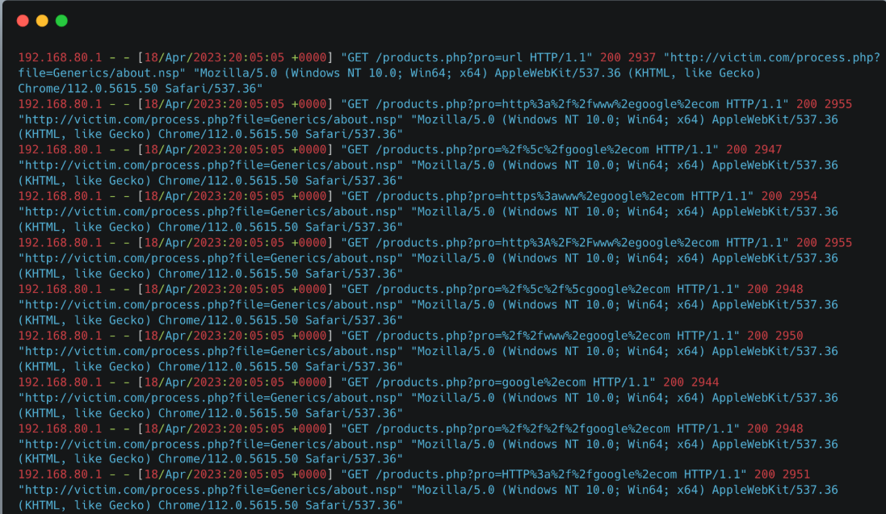
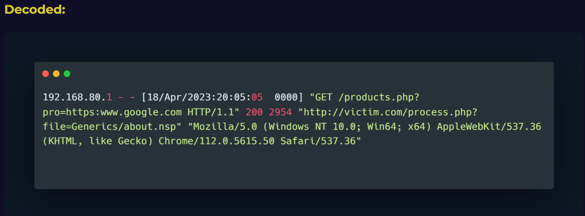
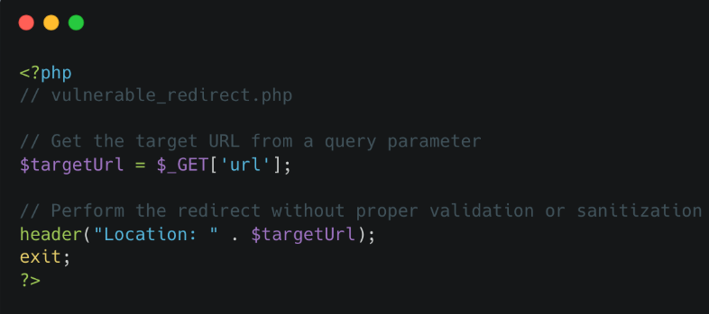
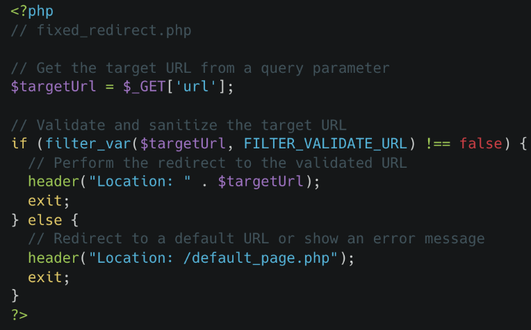

# 📘 SOC Analyst Handbook: Detecting Open Redirection

**Category:** Web Application Security / Social Engineering Support
**Severity:** Medium (High if chained with Phishing/OAuth attacks)
**Skill Level:** Fundamental

---

### 1. The Concept

**The Analogy (ELI5)**
Imagine you click a trusted bank’s link in an email. Instead of taking you to the bank’s site, the link first asks the bank’s receptionist, “Where should I send this visitor?” If the receptionist blindly follows whatever address you provide, you get redirected to a malicious site. You think you’re still dealing with the bank, but you’re actually at the attacker’s page.

In short: the trusted site becomes an unwitting guide to a dangerous location.

**The Technical Definition**
**Open Redirection** is a vulnerability where a web application accepts a user-controlled input (like a URL parameter) and uses it to update the browser's location (via HTTP `Location` headers, meta tags, or JavaScript) without validating that the destination is within a trusted domain. This allows an attacker to construct a URL that looks like it belongs to a legitimate site but instantly redirects the victim to an external, malicious site.

---

### 2. The Attack Mechanism

#### **How it works**
Applications often use parameters to track where a user should go after an action (like logging in).
1.  **Legitimate Flow:**
    `https://bank.com/login.php?next=/dashboard`
    The server sees `/dashboard`, logs the user in, and sends them there.
2.  **The Exploit:**
    The attacker crafts a phishing link:
    `https://bank.com/login.php?next=http://fake-bank.com`
3.  **The Result:**
    The victim sees `bank.com` in the link and clicks it. The server processes the request and sends an **HTTP 302 Found** response with the header:
    `Location: http://fake-bank.com`
    The browser automatically follows this, landing the user on the phishing site.

#### **Types/Vectors**
*   **URL-Based:** The most common. Using parameters like `url=`, `next=`, `dest=`, `redirect=`.
*   **JavaScript-Based:** The server doesn't send a 302 header. Instead, a script on the page runs `window.location = new_url`.
*   **Header-Based:** The application trusts the `Referer` or `Host` header to determine where to send the user.

---

### 3. The Detective's Lens (Logs & Patterns)

As a SOC Analyst, you are looking for **URLs inside of URLs**. You need to spot external domains appearing in query strings.

#### **Key Indicators**
*   **Suspicious Parameters:** `?next=`, `?url=`, `?target=`, `?r=`, `?dest=`, `?redirect_to=`.
*   **Protocol Handlers:** `http://`, `https://`, `ftp://`.
*   **Encoded Characters:**
    *   `%3A%2F%2F` = `://`
    *   `%2F` = `/`
*   **Bypass Obfuscation:** Attackers know you look for `http`. They might use:
    *   `//google.com` (Protocol relative)
    *   `/\/google.com`
    *   `http://2130706433` (Decimal IP address)
    *   `http://0x7f000001` (Hex IP address)




#### **Example Log Snippet (Malicious)**
```text
192.168.31.174 - - [18/Apr/2023:20:05:05] "GET /?pro=http%3A%2F%2Fgoogle.com HTTP/1.1" 302 0 "-" "Mozilla/5.0..."
```
*   **Analysis:**
    *   **Parameter:** `pro=` (A non-standard parameter, likely used for promotion redirects).
    *   **Payload:** `http%3A%2F%2Fgoogle.com` (Decodes to `http://google.com`).
    *   **Status 302:** The server replied with "Found" (Redirect). This indicates the redirection **successfully happened**.

---

### 4. Investigation Steps (The Playbook)

**Step 1: Decode the URI**
*   Web logs are messy. You will see `%3A` instead of `:`.
*   **Action:** Use a URL Decoder.
*   *Before:* `?url=http%3A%2F%2Fevil.com`
*   *After:* `?url=http://evil.com` -> Clearly visible now.

**Step 2: Check the Destination**
*   Is the parameter pointing to an internal path (starts with `/`) or an external domain (`http://...`)?
*   If it is external, is it a partner site? (e.g., A PayPal link on a shopping site is normal). If it is a random domain, it is an attack.

**Step 3: Check the Response Code**
*   **301 / 302:** The server executed the redirect.
*   **200 OK:**
    *   *Scenario A:* The server ignored the redirect (Good).
    *   *Scenario B:* The server used **JavaScript** to redirect (Bad). You need to check the response body to be sure.
*   **403 / 404:** The attack was blocked or the page doesn't exist.

**Step 4: Check for Phishing Correlation**
*   Open Redirect is rarely the end goal. It is the delivery method.
*   **Action:** Check email logs. Did any employees receive an email containing this specific link?

---

### 5. Remediation & Defense

**Immediate Actions (SOC)**
1.  **Block the specific payload:** If you see a massive campaign redirecting to `malware.com`, write a WAF rule to block that specific domain in parameters.

**Long-term Fixes (Engineering)**
1.  **Whitelist (Allow-list):** The code should check the input against a list of trusted domains.
2.  **Indirect References:** Do not use raw URLs. Use tokens: `?redirect_id=login_success`.
3.  **Force Relative Paths:** Strip `http://` and domain names from the input, forcing the redirect to stay on your own website.

---

### 💻 6. Code Lab: Vulnerable vs. Secure


**The Flaw:** The code directly assigns the user-supplied `url` parameter to the PHP `$targetUrl` variable. It then passes this variable immediately into the `header("Location: ...")` function without checking if the URL is internal or external.


**The Fix:** The code implements `filter_var` with the `FILTER_VALIDATE_URL` flag. While this ensures the input is a valid URL format, a **production-grade fix** should also include a "Whitelist" check to ensure the domain matches the company's specific trusted domains, rather than just any valid URL.

---

### 🛑 SOC Pro-Tips (Beyond the Basics)

1.  **The "Chain" Attack (OAuth Theft):**
    *   Open Redirect is dangerous in OAuth flows (Login with Google/Facebook).
    *   Attackers use Open Redirect to steal the **OAuth Token**.
    *   *Flow:* `Login -> Callback URL (Vulnerable to Redirect) -> Attacker's Server logs the Token`.

2.  **Regex Detection Logic:**
    *   To catch this in a SIEM (Splunk/ELK), use a Regex that looks for HTTP protocols inside query strings:
    *   `GET .*\?.*=(https?%3a%2f%2f)`
    *   *Translation:* Look for "GET", followed by any parameters `?`, followed by an encoded `http://`.

3.  **Filter Bypasses:**
    *   Developers often block `http`.
    *   Attackers use `//evil.com`. Browsers treat `//` as "Use the current protocol" (redirects successfully). Ensure your developers filter `//` too.

---

### TL;DR for Interviews / Quick Recall
*   **What:** Application redirects users to an untrusted external domain based on user input.
*   **Why:** Lack of validation on destination parameters (e.g., `?next=`).
*   **Impact:** **Phishing credibility** (URL looks real), Malware distribution, OAuth token theft.
*   **Detection:** Query parameters containing URLs (`http`, `//`) or encoded equivalents (`%3A%2F%2F`).
*   **Response:** Decode URL → Check if destination is malicious → Check response code (301/302).
*   **Fix:** **Whitelisting** allowed domains or enforcing relative paths (start with `/`).

### 🎯 MITRE ATT&CK Mapping
*   **T1204:** User Execution (Malicious Link).
*   **T1566:** Phishing (Spearphishing Link).
*   **T1190:** Exploit Public-Facing Application.

### ⚠️ Avoid Assumptions
*   **Low Severity = Ignore:** Open Redirect is often labeled "Low" by scanners. In a Phishing campaign, it is the **Critical** enabler.
*   **Status 200 = Safe:** JavaScript redirects (DOM-based) return status 200 but still redirect the user.
*   **Only `http` is bad:** `data:`, `javascript:`, and `vbscript:` protocols in parameters can lead to XSS, not just redirection.