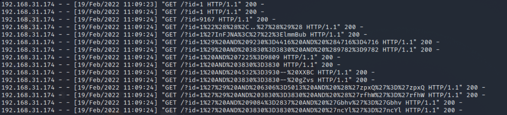

# 📘 SOC Analyst Handbook: Detecting SQL Injection (SQLi)

**Category:** Web Application Attacks
**Severity:** Critical
**Skill Level:** Fundamental

---

### 1. The Concept (ELI5)
SQL Injection (SQLi) is a vulnerability where an application takes untrusted user input and processes it directly as part of a database query without proper validation or escaping.

Fundamentally, this occurs because the application fails to distinguish between data (what the user types) and code (the commands the database executes). By injecting specific SQL syntax characters, an attacker can break out of the intended data field and manipulate the structure of the query itself. This allows them to execute unauthorized commands—such as retrieving hidden data, modifying database entries, or bypassing authentication—under the identity of the application.

---

### 2. The Attack Mechanism

#### **How it works**
Web applications use **Structured Query Language (SQL)** to talk to databases (e.g., to fetch a user profile).
1.  **Normal Flow:** User enters `user` and `pass`. The app puts them into a query:
    `SELECT * FROM users WHERE username = 'user' AND password = 'pass'`
2.  **The Exploit:** The attacker enters a payload containing special characters like `' OR 1=1 -- -`.
3.  **The Result:** The query becomes:
    `SELECT * FROM users WHERE username = '' OR 1=1 -- - AND password = 'pass'`
    *   `'`: Closes the data field.
    *   `OR 1=1`: A statement that is **always true**.
    *   `--` or `#`: Comments out the rest of the query (ignoring the password check).

#### **Types of SQLi**
1.  **In-band (Classic):** The attacker sees the results immediately on the screen (e.g., a list of users appears). This is the easiest to exploit and detect.
2.  **Inferential (Blind):** The application doesn't show data, but the behavior changes.
    *   *Boolean-based:* The page loads differently if the query is TRUE vs FALSE.
    *   *Time-based:* The attacker tells the DB to "sleep for 10 seconds." If the page takes 10 seconds to load, they know the injection worked.
3.  **Out-of-band:** The attacker forces the database to send data elsewhere (e.g., via DNS or HTTP requests to a server they own).

---

### 3. The Detective's Lens (Logs & Patterns)

As a SOC Analyst, you are rarely looking at the code; you are looking at **Logs** (Apache, Nginx, IIS, WAF). You need to spot the patterns inside the noise.

#### **Key Indicators**
*   **SQL Keywords:** `UNION`, `SELECT`, `INSERT`, `UPDATE`, `DROP`, `CHAR`, `CONCAT`.
*   **Logic Statements:** `OR 1=1`, `OR 'a'='a'`.
*   **Comments/Syntax:** `'` (Single Quote), `--`, `#`, `/*`.
*   **System Commands:** `xp_cmdshell` (tries to run OS commands via SQL).
*   **Encoding:** Attackers rarely send plain text. They use **URL Encoding**.
    *   `%27` = `'` (Single Quote)
    *   `%20` = (Space)
    *   `%23` = `#`
    *   `%3D` = `=`




#### **Detecting Automated Tools (e.g., Sqlmap)**
Attackers use tools to scan fast. You can spot them by:
1.  **User-Agent:** The tool often identifies itself (e.g., `User-Agent: sqlmap/1.4`).
2.  **Request Frequency:** A human clicks once every few seconds. A tool sends **50+ requests per second**.
3.  **Pattern:** Highly complex payloads appearing rapidly (e.g., lots of nesting and strange hex characters).

#### **Example Log Snippet (Malicious)**
```text
192.168.31.174 - - [19/Feb/2022:11:09:24 +0000] "GET /product.php?id=1%27+UNION+SELECT+user,password+FROM+users-- HTTP/1.1" 200 4502 "-" "Mozilla/5.0..."
```
*   **Analysis:** The presence of `%27` (quote) followed by `UNION SELECT` confirms an attempt to inject SQL commands.

---

### 4. Investigation Steps (The Playbook)

If you see a suspicious log, follow this workflow:

**Step 1: Decode the URL**
*   Raw logs are often URL-encoded (lots of `%` signs).
*   **Action:** Copy the request URL and use a tool like CyberChef (URL Decode).
*   *Warning:* **NEVER** paste real client logs into public online decoders. Use offline tools or CyberChef locally.

**Step 2: Check the "Response Size" (Crucial for Success Determination)**
*   This is how you distinguish a **Failed Attempt** from a **Data Breach**.
*   **Scenario:**
    *   Normal Page Size: `1500 bytes`
    *   Attack Request A: `1500 bytes` (Attack failed, page loaded normally).
    *   Attack Request B: `50000 bytes` (Anomaly! The database likely dumped a massive table of data).
*   **Note:** If you see `HTTP 500` (Internal Server Error), the injection likely caused a syntax error. The attack happened, but it might not have succeeded in stealing data *yet*.

**Step 3: Analyze the Source**
*   Is the IP scanning many endpoints? (Automated Scanner).
*   Is the payload manually crafted? (Targeted human attacker).
*   Check the `User-Agent` string.

**Step 4: Correlate**
*   Did the same IP trigger other alerts?
*   Did the Firewall/WAF block it (403 Forbidden) or allow it (200 OK)?

---

### 5. Remediation & Defense

**Immediate Actions (SOC)**
1.  **Block the IP:** If the attack is ongoing and automated.
2.  **Check WAF Rules:** Ensure your Web Application Firewall is configured to block common SQL keywords and patterns.

**Long-term Fixes (Engineering)**
1.  **Parameterized Queries (Prepared Statements):** This is the gold standard. It forces the database to treat user input as data, not executable code.
2.  **Input Sanitization:** Validate all input. If a field expects a number (e.g., ID=5), reject anything that contains letters or symbols.
3.  **Least Privilege:** The web app's database user should only have permission to read what it needs. It should never have admin/root rights to drop tables or run OS commands.

---

### 🛑 SOC Pro-Tips (Beyond the Basics)

1.  **The "False Positive" Trap:**
    *   Sometimes a legitimate URL looks like SQLi.
    *   *Example:* A blog post titled "Select the best union for you" might generate a URL like `/blog?title=select-best-union`.
    *   *Differentiation:* Look at the context. Is there syntax syntax like `'` or `--`? If not, it might be safe.

2.  **Headers are vectors too:**
    *   Most beginners only look at the URL or Form Data.
    *   Attackers can inject SQL into **HTTP Headers** (like `User-Agent`, `Referer`, or `X-Forwarded-For`). Always check headers if the logs capture them.

3.  **Blind SQLi is Silent:**
    *   If an attacker is doing "Time-Based Blind SQLi", the status code will be 200 OK and the size will be normal.
    *   **Detection:** Look at the **"Time Taken"** field in the logs. If a specific request took 10,000ms (10 seconds) while others take 200ms, that is a massive red flag.


### TL;DR for Interviews / Quick Recall
*   **What:** SQL injection = user input manipulates the database query.
*   **Why:** Application trusts user input + concatenates strings instead of using parameterized queries.
*   **Impact:** Data theft (dumping DB), Auth bypass (login without password), RCE (via `xp_cmdshell`).
*   **Detection:** SQL keywords (`UNION`, `SELECT`), logic (`OR 1=1`), or syntax errors in logs.
*   **Response:** Block IP → Decode payload → Check response size (did data leave?).
*   **Fix:** **Parameterized Queries** (Prepared Statements) + Input Validation.

### 🎯 MITRE ATT&CK Mapping
*   **T1190:** Exploit Public-Facing Application.
*   **T1059:** Command and Scripting Interpreter (if RCE occurs).
*   **T1041:** Exfiltration Over C2 Channel (if data is dumped).

### ⚠️ Avoid Assumptions
*   **Large Response Size ≠ Always Data Theft:** Sometimes the error message itself is huge (stack trace).
*   **HTTP 500 ≠ Failed Attack:** A 500 error might mean the injection worked but broke the page syntax. The DB might still have processed part of it.
*   **No "Union Select" ≠ Safe:** Blind SQLi extracts data byte-by-byte without showing it on screen.

---