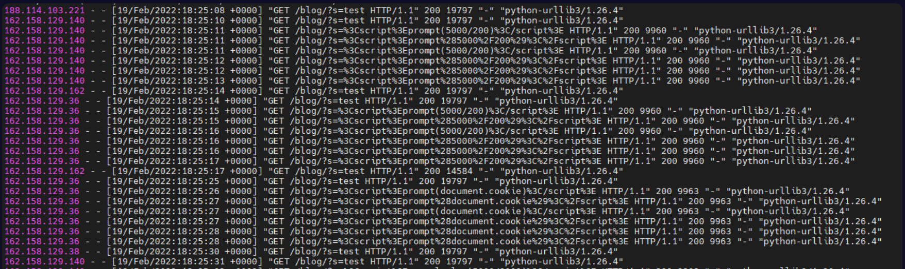
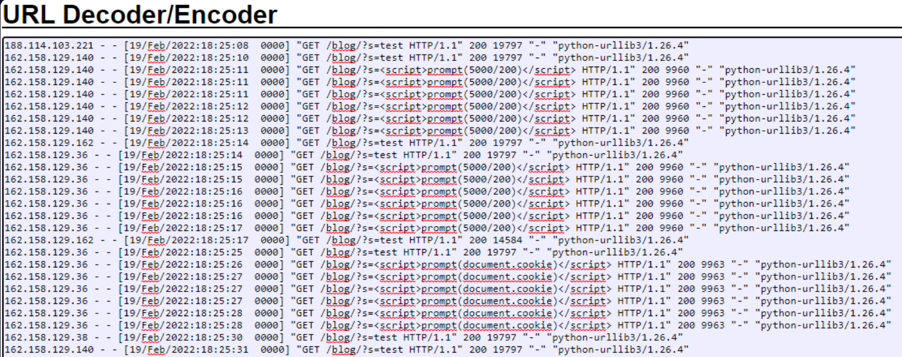

# 📘 SOC Analyst Handbook: Detecting Cross-Site Scripting (XSS)

**Category:** Web Application Attacks
**Severity:** High
**Skill Level:** Fundamental

---

### 1. The Concept
**Cross-Site Scripting (XSS)** is an injection vulnerability that allows an attacker to execute malicious scripts (usually JavaScript) in the browser of a victim.

Unlike SQL Injection (which attacks the *database*), XSS attacks the **user**. The vulnerability exists because the application takes untrusted data (like a search term or comment) and sends it to a web browser without validating or escaping it. The browser, assuming the data is trusted content from the website, executes the malicious script. This allows attackers to steal session cookies, perform actions on behalf of the user, or redirect them to phishing sites.

---

### 2. The Attack Mechanism

#### **How it works**
1.  **Injection:** The attacker inputs a script into the application (e.g., a search bar).
    *   *Payload:* `<script>alert('Hacked')</script>`
2.  **Processing:** The server receives the input but fails to "sanitize" it (remove the code tags).
3.  **Execution:** The server sends the page back to the browser. The browser sees `<script>` and runs the code.
    *   *Result:* A popup appears, or in a real attack, the user's session ID is silently sent to the attacker.

#### **Types of XSS**
1.  **Reflected XSS (Non-Persistent):** The malicious script is part of the request (e.g., a malicious link). The victim must click the link for the code to run. It is "reflected" off the web server immediately.
2.  **Stored XSS (Persistent):** The attacker saves the malicious script to the server (e.g., in a forum post or database). *Every* user who views that page gets attacked. This is the most dangerous type.
3.  **DOM-Based XSS:** The vulnerability is in the client-side code (JavaScript) itself, modifying the "environment" (DOM) of the browser without necessarily sending the payload to the server.

---

### 3. The Detective's Lens (Logs & Patterns)

As a SOC Analyst, you are looking for HTML tags and JavaScript keywords appearing in **URL parameters** or **User-Agent strings**.

#### **Key Indicators**
*   **HTML/JS Tags:** `<script>`, `<iframe>`, `<body>`, ``, `<svg>`.
*   **Event Handlers:** `onload`, `onerror`, `onclick`, `onmouseover`.
*   **Keywords:** `alert()`, `document.cookie`, `eval()`, `window.location`.
*   **Protocol Handlers:** `javascript:`, `vbscript:`.
*   **Encoding:** Attackers heavily use URL encoding to hide syntax.
    *   `%3C` = `<`
    *   `%3E` = `>`
    *   `%22` = `"` (Double Quote)





#### **Detecting Automated Scanners**
In the LetsDefend lab scenario, the logs showed specific patterns indicating automation:
1.  **Frequency:** Requests arriving every 3–4 seconds (too fast for a human typing complex payloads).
2.  **User-Agent:** Tools often leak their identity.
    *   *Example:* `Python-urllib/3.8` (Indicates a script, not a browser).
3.  **Cloudflare/CDN:** If the Source IP belongs to Cloudflare, the real attacker is hidden behind the CDN. You must look at `X-Forwarded-For` headers to find the true IP.

#### **Example Log Snippet (Malicious)**
```text
192.168.31.183 - - [01/Mar/2022:08:53:20 +0000] "GET /blog/?s=%3Cscript%3Ealert(1)%3C%2Fscript%3E HTTP/1.1" 200 3421 "-" "Python-urllib/3.8"
```
*   **Analysis:**
    *   **Method:** `GET` request to WordPress search (`?s=`).
    *   **Payload:** `%3Cscript%3E...` decodes to `<script>alert(1)</script>`.
    *   **Status 200:** The server accepted the request (likely successful execution).
    *   **UA:** `Python-urllib` indicates an automated scanner.

---

### 4. Investigation Steps (The Playbook)

**Step 1: Decode the URL**
*   XSS payloads are almost always encoded.
*   **Action:** Use CyberChef "URL Decode". Look for `<` or `javascript:` after decoding.

**Step 2: Identify the Parameter**
*   Where is the code being injected?
    *   *Example:* In the log above, it is the `s=` (search) parameter.
    *   *Action:* Check if this parameter is reflected on the page.

**Step 3: Analyze the Status Code & Response**
*   **200 OK:** The page loaded. If the payload was Reflected XSS, the script likely ran.
*   **403 Forbidden / 406 Not Acceptable:** The WAF or server security likely blocked the attack.
*   **Response Size:** Compare the size of the attack response vs. a normal request. If they are identical, the attack likely succeeded in rendering the page.

**Step 4: Check for Exfiltration**
*   XSS is often used to steal cookies.
*   **Search Logs:** Look for the victim IP making a request to an external domain immediately after the XSS trigger, often containing long random strings (stolen session tokens).

---

### 5. Remediation & Defense

**Immediate Actions (SOC)**
1.  **Block the Attacker IP:** If the attack is from a direct IP (not a CDN).
2.  **WAF Tuning:** Update WAF signatures to block tags like `<script>` and attributes like `onerror` in input fields.

**Long-term Fixes (Engineering)**
1.  **Input Sanitization:** "Clean" the data. Remove unsafe characters before the server processes them.
2.  **Output Encoding:** Convert special characters into their HTML entity equivalents before displaying them.
    *   Convert `<` to `&lt;` (The browser displays it as text, but won't run it as code).
3.  **Content Security Policy (CSP):** A browser mechanism that tells the browser, "Only run scripts that come from THESE specific trusted domains." It stops unauthorized inline scripts.

---

### 🛑 SOC Pro-Tips (Beyond the Basics)

1.  **The "Polyglot" Payload:**
    *   Attackers use strings that are valid in multiple contexts (HTML, CSS, JS) to bypass basic filters.
    *   *Example:* `javascript://%250Aalert(1)//` inside an image tag.
    *   *Detection:* Don't just look for `<script>`. Look for any data containing parentheses `()` combined with text in a URL parameter.

2.  **Stored XSS is quieter:**
    *   In Stored XSS, you might see **one** malicious POST request (the attacker uploading the comment).
    *   Later, you see **many** innocent users loading that page. The logs won't show the payload in the *victim's* request, only in the *attacker's original* request.

3.  **False Positives in Referers:**
    *   Sometimes valid marketing URLs contain tracking scripts or complex query strings. Always decode to verify if it is executable code or just a tracking ID.


### TL;DR for Interviews / Quick Recall
*   **What:** XSS = Attacker runs malicious scripts in the victim's browser.
*   **Why:** Application takes user input and displays it (reflects/stores) without sanitization/escaping.
*   **Impact:** Session hijacking (cookie theft), phishing redirects, defacement.
*   **Detection:** HTML tags (`<script>`, ``, `<iframe>`) or JS keywords (`alert`, `document.cookie`) in logs.
*   **Response:** Block IP → Check if payload is Stored or Reflected → Revoke compromised sessions.
*   **Fix:** **Output Encoding** (convert `<` to `&lt;`) + Content Security Policy (CSP).

### 🎯 MITRE ATT&CK Mapping
*   **T1059.007:** Command and Scripting Interpreter: JavaScript.
*   **T1189:** Drive-by Compromise.
*   **T1539:** Steal Web Session Cookie.

### ⚠️ Avoid Assumptions
*   **HTTP 200 OK ≠ Successful Attack:** Modern browsers (Chrome/Edge) have built-in XSS filters that might block the script even if the server sent it.
*   **Reflected XSS is "Low Risk":** False. If used in a phishing email to an Admin, it causes full compromise.
*   **WAF caught it ≠ Safe:** Attackers use "Polyglots" (complex strings) that often bypass regex-based WAFs.

---
