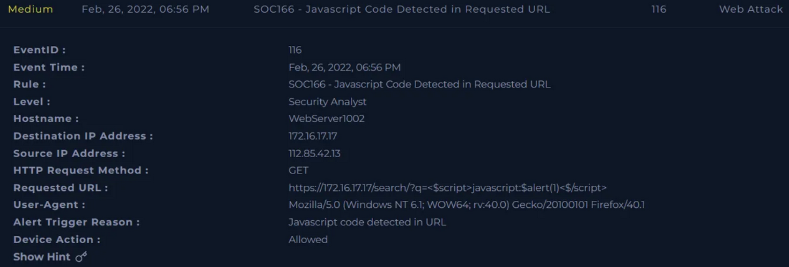
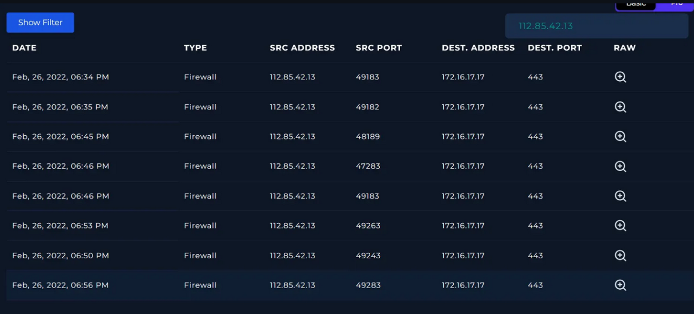

# Javascript Code Detected in Requested URL — Case #SOC166

## Alert Overview
- Severity: High
- Detection Source: SIEM / IDS Alert
- Asset Affected: WebServer1002 (172.16.17.17)
- Threat Type: Cross-Site Scripting (XSS)
- Status: True Positive

s

## Investigation Steps
1. Initial indicator identified from a SIEM alert involving a suspicious URL request containing script tags.
2. Analyzed the raw HTTP request to identify the specific payload and target parameter.
3. Performed log correlation to determine the server's response status and response body size.
4. Conducted threat intelligence enrichment on the source IP address to identify historical malicious behavior.
5. Evaluated the application's handling of the malicious input to verify if the script was reflected or executed.

## Analysis & Findings
The investigation revealed a series of persistent Cross-Site Scripting (XSS) attempts originating from the external IP 112.85.42.13. The attacker targeted the `/search/` directory, specifically utilizing the `q` query parameter to inject malformed JavaScript. The primary payload observed was `<$script>javascript:$alert(1)<$/script>`, a classic proof-of-concept used to verify reflected XSS vulnerabilities. The attacker utilized malformed tags (`<$script>`) in an attempt to circumvent basic signature-based security filters.

Despite the persistent nature of the attempts, log analysis confirms that the attack was unsuccessful. Every malicious request was met with an HTTP 302 Redirect status code and a response size of 0 bytes. This indicates that the web server redirected the client before the payload could be processed or reflected in the response body. For a reflected XSS attack to pose a threat, the script must be returned to the client browser within the HTML response; the zero-byte response effectively neutralized this threat vector. Threat intelligence lookups via AbuseIPDB and VirusTotal confirmed the source IP is a known malicious actor with multiple reports for web-based attacks.

## Indicators of Compromise

| Type | Value | Context |
|------|------|--------|
| IP | 112.85.42.13 | Source of repeated XSS attempts. |
| URL | `https://172.16.17.17/search/?q=<$script>javascript:$alert(1)<$/script>` | Malicious URL containing XSS payload. |
| Hostname | WebServer1002 | Targeted web server. |

## Response & Closure
- Action Taken: Confirmed attack failure through response code analysis; verified malicious intent via threat intelligence; documented the event for security trending.
- Containment Required: No
- Closure Reason: True Positive — Unsuccessful Cross-Site Scripting attempt.

**Strategic Recommendations:**
1. **Implementation of Content Security Policy (CSP):** Deploy a strict CSP header to restrict the execution of unauthorized scripts and prevent the browser from executing inline JavaScript.
2. **Input Sanitization and Output Encoding:** Ensure that all user-supplied input is sanitized on arrival and contextually encoded before being rendered in the browser. This prevents the browser from interpreting data as executable code.
3. **WAF Rule Optimization:** Review and update Web Application Firewall (WAF) rules to specifically block malformed tags and common XSS patterns at the perimeter.
4. **IP Blocklisting:** Add 112.85.42.13 to the edge firewall blocklist to mitigate further reconnaissance or automated scanning from this actor.

## Skills & Tools Used
SIEM, Log Management, AbuseIPDB, VirusTotal, HTTP Protocol Analysis, Web Attack Analysis (XSS), Threat Intelligence, Incident Triage.